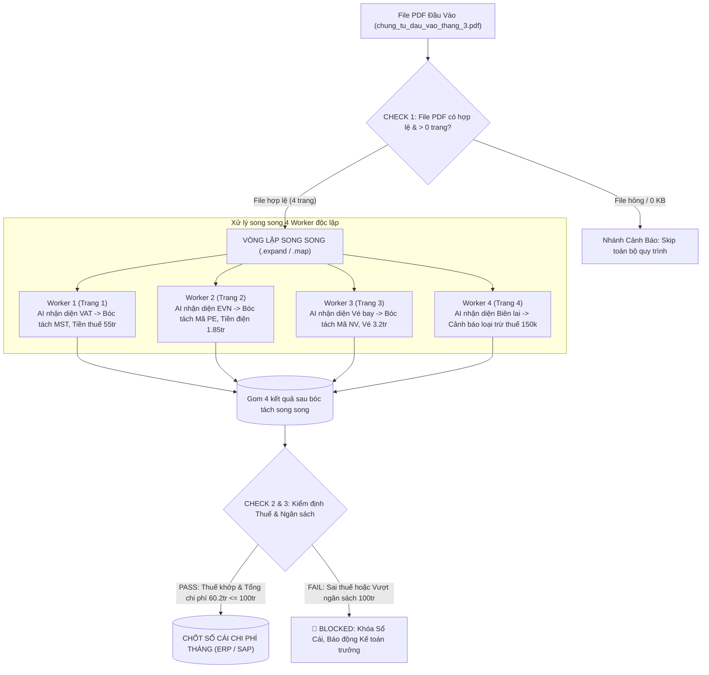

# 📖 TÀI LIỆU DỰ ÁN: XỬ LÝ FILE PDF ĐA HÓA ĐƠN (AIRFLOW VS. DAGSTER)

---

## 🎯 1. BÀI TOÁN KINH DOANH CHUNG (100% UNIFIED SCENARIO)

### 💡 Bối cảnh dự án
Hàng tháng, phòng Kế toán & Tài chính tiếp nhận **1 tệp PDF tổng hợp chứa nhiều hóa đơn chứng từ đầu vào** (`chung_tu_dau_vao_thang_3.pdf`).

Thay vì bóc tách thủ công, hệ thống cần tự động:
1. **Phân tách các trang PDF** và chạy **Vòng lặp song song 100%** qua từng trang.
2. **AI nhận diện loại hóa đơn & Rẽ nhánh bóc tách chuyên biệt** ngay trong từng worker:
   - **Trang 1 (VAT)**: Bóc tách MST 0101234567, Tiền gốc 50tr + VAT 5tr = **55.000.000 VNĐ** (Khấu trừ thuế: CÓ).
   - **Trang 2 (Tiện ích EVN)**: Bóc tách Mã KH PE0100098765, Tiền điện = **1.850.000 VNĐ** (Khấu trừ thuế: CÓ).
   - **Trang 3 (Công tác phí)**: Bóc tách Vé máy bay NV-889 Nguyễn Văn A = **3.200.000 VNĐ** (Khấu trừ thuế: CÓ).
   - **Trang 4 (Biên lai bán lẻ)**: Bóc tách Mua trà cà phê tiếp khách = **150.000 VNĐ** (Khấu trừ thuế: KHÔNG - Cảnh báo).
3. **Thực hiện 3 Chốt Chặn Kiểm Định (Checks)**:
   - **Check 1 (File Integrity)**: Kiểm tra file PDF hợp lệ, có số trang $> 0$.
   - **Check 2 (VAT Math)**: Kiểm tra công thức thuế GTGT ($\text{Tổng thanh toán} == \text{Tiền trước thuế} + \text{VAT}$).
   - **Check 3 (Budget Limit Compliance - BLOCKING)**: Tổng chi phí $\le 100.000.000\text{ VNĐ}$ và không có số tiền âm.
4. **Chốt Sổ Cái Chi Phí Tháng** và đẩy vào hệ thống ERP / SAP:
   - **Tổng chi phí**: **$60.200.000\text{ VNĐ}$**
   - **Thuế VAT được khấu trừ**: **$5.000.000\text{ VNĐ}$**

---

## 🔄 2. SƠ ĐỒ LUỒNG THỰC THI (PARALLEL DYNAMIC ROUTING)



---

## ⚖️ 3. SO SÁNH 2 GÓC NHÌN TRÊN CÙNG MỘT BÀI TOÁN

```text
               ┌──────────────────────────────────────────────────────────┐
               │         CÙNG 1 BÀI TOÁN: XỬ LÝ FILE PDF HÓA ĐƠN          │
               │         (chung_tu_dau_vao_thang_3.pdf - 4 trang)         │
               └────────────────────────────┬─────────────────────────────┘
                                            │
           ┌────────────────────────────────┴────────────────────────────────┐
           ▼                                                                 ▼
┌──────────────────────────────────────┐          ┌──────────────────────────────────────┐
│  GÓC NHÌN 1: APACHE AIRFLOW          │          │  GÓC NHÌN 2: DAGSTER                 │
│  (TASK-CENTRIC / PIPELINE AS TASKS)  │          │  (DATA-CENTRIC / PIPELINE AS ASSETS) │
├──────────────────────────────────────┤          ├──────────────────────────────────────┤
│ 📂 File:                              │          │ 📂 File:                              │
│ airflow_demo/dags/                   │          │ dagster_demo/invoice_processing/     │
│ invoice_multipage_pdf_dag.py         │          │ assets.py                            │
│                                      │          │                                      │
│ 🛠️ Triển khai:                       │          │ 🛠️ Triển khai:                       │
│ 1. Ingest PDF                        │          │ 1. Asset: raw_multipage_invoice_pdf  │
│ 2. Check 1: @task.branch             │          │ 2. Check 1: @asset_check             │
│    (check_pdf_integrity)             │          │    (check_pdf_file_integrity)        │
│ 3. Vòng lặp song song:               │          │ 3. Asset: extracted_invoice_pages    │
│    process_and_route_single_page     │          │ 4. Asset: categorized_invoices       │
│    .expand(page=pages)               │          │ 5. Check 2: @asset_check thuế VAT    │
│ 4. Check 2 & 3: @task.branch         │          │ 6. Check 3: @asset_check(blocking)   │
│    (audit_financial_budget)          │          │    (check_budget_limit_compliance)   │
│ 5. Chốt sổ cái:                      │          │ 7. Asset: monthly_expense_ledger     │
│    lock_and_publish_financial_ledger │                                                 │
│                                      │ 🎯 Ưu điểm vượt trội:                   │
│ 🎯 Ưu điểm vượt trội:                │ • Quản lý trọn vẹn vòng đời dữ liệu     │
│ • Điều phối worker song song 100%    │ • Chốt chặn blocking tự động khóa luồng │
│ • Mở rộng N trang không cần sửa code │ • Data Catalog xem trực tiếp metadata   │
└──────────────────────────────────────┘          └──────────────────────────────────────┘
```

---

## 📊 4. ĐỐI CHIẾU KẾT QUẢ ĐẦU RA (GIỐNG NHAU 100%)

| Chỉ số tổng kết | Apache Airflow | Dagster |
| :--- | :---: | :---: |
| **Tổng số trang xử lý** | 4 trang | 4 trang |
| **Tổng chi phí phê duyệt** | **60.200.000 VNĐ** | **60.200.000 VNĐ** |
| **Tổng tiền thuế VAT được khấu trừ** | **5.000.000 VNĐ** | **5.000.000 VNĐ** |
| **Số hóa đơn hợp lệ khấu trừ** | 3 hóa đơn | 3 hóa đơn |
| **Số chứng từ bị cảnh báo loại trừ thuế** | 1 biên lai (150.000 VNĐ) | 1 biên lai (150.000 VNĐ) |
| **Kết quả kiểm toán tài chính** | ✅ PASSED & LOCKED | ✅ AUDITED_AND_COMPLIANT |

---

## 🚀 5. HƯỚNG DẪN CHẠY VÀ KIỂM THỬ

### 1. Chạy Dagster Web UI (Cổng 3000)
```bash
./run_dagster_dev.sh
```
* Mở trình duyệt: `http://localhost:3000`
* Xem tab **Assets** $\rightarrow$ Thấy nhóm `invoice_pipeline`.
* Xem tab **Asset Checks** $\rightarrow$ Thấy 3 chốt chặn kiểm định: File Integrity, VAT Math, và Budget Limit.

### 2. Chạy Airflow Web UI (Cổng 8080)
```bash
./run_airflow_standalone.sh
```
* Mở trình duyệt: `http://localhost:8080`
* Bật DAG `invoice_multipage_pdf_airflow_dag` và bấm **Trigger DAG** (▶️).
* Nhấp vào Task `process_and_route_single_page` để thấy **4 Mapped Instances** (`[0]`, `[1]`, `[2]`, `[3]`) chạy song song độc lập.

### 3. Chạy Toàn Bộ Unit Tests
```bash
PYTHONPATH=. pytest dagster_demo/tests/ -v
```
*(Kết quả: 4/4 tests passed 100%).*
