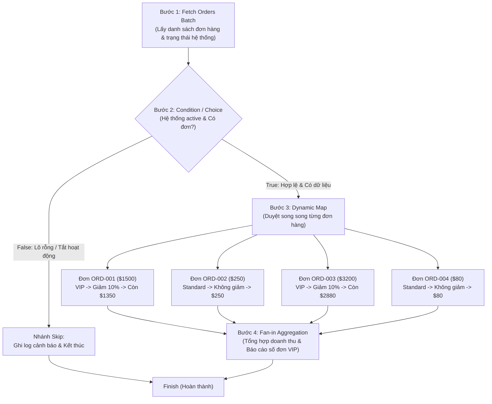

# 📖 TÀI LIỆU DỰ ÁN: Ý TƯỞNG, LUỒNG NGHIỆP VỤ & CƠ CHẾ AIRFLOW VS DAGSTER

---

## 🎯 1. Ý TƯỞNG & BÀI TOÁN KINH DOANH (BUSINESS CONTEXT)

### 💡 Bối cảnh dự án
Dự án này giải quyết bài toán cốt lõi: **Xử lý lô đơn hàng thương mại điện tử tự động (Order Processing Pipeline)**.
Đây là bài toán kinh điển mô phỏng quy trình xử lý workflow phức tạp (trước đây thường chạy trên **AWS Step Functions** trên Cloud) và được đưa về vận hành **On-Premise / Kubernetes** thông qua 2 nền tảng mã nguồn mở hàng đầu: **Apache Airflow** và **Dagster**.

### 🎯 Mục tiêu so sánh
Đặt **cùng 1 tập dữ liệu và cùng 1 logic nghiệp vụ** lên cả Airflow và Dagster để so sánh trực quan:
1. Cách viết code và tổ chức pipeline.
2. Cách xử lý điều kiện rẽ nhánh (Choice / If-Else).
3. Cách chạy vòng lặp song song nhiều phần tử (Dynamic Mapping / Map State).
4. Cách gom kết quả báo cáo (Fan-in Aggregation).
5. Cơ chế lưu trữ và luân chuyển dữ liệu giữa các bước.
6. Cách hiển thị và kiểm thử (Dev Experience & Web UI).

---

## 🔄 2. CHI TIẾT LUỒNG NGHIỆP VỤ 4 BƯỚC (STEP-BY-STEP WORKFLOW)

Toàn bộ quy trình xử lý đơn hàng trải qua **4 bước tuần tự và rẽ nhánh** như sau:



### Chi tiết logic từng bước:

### 🔹 Bước 1: Thu thập dữ liệu lô (`Fetch Batch Data`)
* **Hành động**: Lấy danh sách lô đơn hàng cần xử lý kèm cờ `is_active = True/False`.
* **Dữ liệu mẫu**:
  ```json
  [
    {"order_id": "ORD-001", "customer": "Alice", "amount": 1500, "item_count": 3},
    {"order_id": "ORD-002", "customer": "Bob", "amount": 250, "item_count": 1},
    {"order_id": "ORD-003", "customer": "Charlie", "amount": 3200, "item_count": 5},
    {"order_id": "ORD-004", "customer": "David", "amount": 80, "item_count": 1}
  ]
  ```

### 🔹 Bước 2: Rẽ nhánh điều kiện (`Choice State / If-Else`)
* **Mục đích**: Kiểm tra lô đơn hàng có đủ điều kiện để xử lý hay không.
* **Điều kiện**:
  - **IF** `is_active == True` VÀ `len(orders) > 0` $\rightarrow$ Chuyển sang **Nhánh Xử Lý (Bước 3)**.
  - **ELSE** $\rightarrow$ Chuyển sang **Nhánh Bỏ Qua (Skip Branch)**: Ghi log cảnh báo và kết thúc mà không chạy các bước nặng phía sau.

### 🔹 Bước 3: Vòng lặp song song & Tính toán chiết khấu (`Dynamic Map State`)
* **Mục đích**: Tách riêng từng đơn hàng để tính giá cuối cùng độc lập, không block lẫn nhau.
* **Quy tắc phân loại (Business Rules)**:
  - **Đơn VIP** (`amount >= 1000$`): Giảm giá 10% $\rightarrow$ `final_price = amount * 0.9`.
  - **Đơn Tiêu Chuẩn** (`amount < 1000$`): Không giảm giá $\rightarrow$ `final_price = amount`.

### 🔹 Bước 4: Gom kết quả & Báo cáo tổng thể (`Fan-in Aggregation`)
* **Mục đích**: Thu thập toàn bộ kết quả đã xử lý từ Bước 3 để tạo báo cáo tài chính tổng quan cho cả lô.
* **Kết quả đầu ra**:
  - `total_orders`: 4 đơn.
  - `vip_orders`: 2 đơn (Alice $1350, Charlie $2880).
  - `total_revenue`: $4,560.
  - `status`: `BATCH_SUCCESS`.

---

## ⚙️ 3. APACHE AIRFLOW LÀM GÌ TRONG DỰ ÁN NÀY?

* **File nguồn**: `airflow_demo/dags/order_processing_dag.py`
* **Triết lý**: **Task-Driven** — Coi pipeline là một chuỗi các **Hành Động / Tasks** được thực thi theo thứ tự phụ thuộc (`A >> B`).

### Cách Airflow giải quyết bài toán:
1. **Định nghĩa DAG**: Sử dụng cú pháp mới `TaskFlow API` (`@dag` và `@task`).
2. **Rẽ nhánh**: Dùng `@task.branch`. Hàm `check_batch_condition` phân tích dữ liệu và trả về chuỗi tên của task tiếp theo (`"prepare_orders_for_mapping"` hoặc `"handle_skipped_batch"`).
3. **Chạy vòng lặp song song (Dynamic Task Mapping)**:
   ```python
   orders_list = prepare_orders_for_mapping(batch_data)
   mapped_orders = process_single_order.expand(order=orders_list)
   ```
   *Airflow tự động sinh ra 4 task instance chạy song song lúc runtime.*
4. **Gom kết quả (Aggregation)**:
   Dùng `trigger_rule=TriggerRule.NONE_FAILED_MIN_ONE_SUCCESS` trên hàm `aggregate_results(mapped_orders)` để nhận list kết quả thông qua cơ chế `XCom`.
5. **Giao diện Airflow Web UI (`http://localhost:8080`)**:
   - Hiển thị đồ thị Graph View với trạng thái màu sắc (Success / Skipped / Failed).
   - Cho phép xem chi tiết từng instance đơn hàng trong tab Mapped Instances.

---

## 💎 4. DAGSTER LÀM GÌ TRONG DỰ ÁN NÀY?

Dagster cung cấp 2 góc nhìn:

### 🅰️ Cách 1: Mô hình Ops & Jobs (Tương thích 1-1 với Step Functions)
* **File nguồn**: `dagster_demo/order_processing/ops_workflow.py`
* **Cách thực hiện**:
  - Dùng `@op` với `DynamicOut` và `DynamicOutput`:
    ```python
    dynamic_orders = fan_out_orders(process_branch)
    processed = dynamic_orders.map(process_single_order)
    aggregate_results(processed.collect())
    ```
  - Dữ liệu được luân chuyển trực tiếp thông qua kiểu dữ liệu strongly-typed.

---

### 🅱️ Cách 2: Triết lý Hiện đại của Dagster — Software-Defined Assets (SDA)
* **File nguồn**: `dagster_demo/order_processing/assets_workflow.py`
* **Triết lý**: **Data-Driven** — Không tập trung vào "chạy task gì", mà tập trung vào **"Tài nguyên dữ liệu nào được sinh ra"**.

1. **Asset 1 (`raw_orders_batch`)**: Bảng chứa dữ liệu thô lấy từ API/Database.
2. **Asset 2 (`validated_orders`)**: Bảng dữ liệu đã được làm sạch, tính chiết khấu VIP.
3. **Asset 3 (`batch_summary_report`)**: Bảng báo cáo tổng kết doanh thu.

### Điểm vượt trội trên Dagster UI (`http://localhost:3000`):
* **Data Lineage (Sơ đồ phả hệ dữ liệu)**: Nhìn thấy luồng dữ liệu biến đổi từ thô sang báo cáo cuối cùng.
* **Gắn kèm Metadata trực tiếp**: Xem ngay trên giao diện tổng doanh thu, số bản ghi VIP, preview 2 dòng dữ liệu mà không cần vào database query.
* **Kiểm thử tự động (Unit Test)**:
  Có thể viết Unit Test kiểm thử từng hàm xử lý đơn hàng bằng `pytest` cực kỳ nhanh mà không cần bật bất kỳ Server hay Database nào:
  ```bash
  PYTHONPATH=. pytest dagster_demo/tests/test_order_processing.py
  ```

---

## 📊 5. BẢNG SO SÁNH TỔNG QUAN

| Tiêu chí | AWS Step Functions (Gốc) | Apache Airflow (Triển khai) | Dagster (Triển khai) |
| :--- | :--- | :--- | :--- |
| **Loại hình kiến trúc** | Serverless Cloud Orchestrator | Task-Driven Orchestrator | Data-Driven Asset Orchestrator |
| **Khai báo luồng** | JSON / Amazon States Language | Code Python thuần (`@dag`, `@task`) | Code Python thuần (`@asset` hoặc `@op`) |
| **Rẽ nhánh (If-Else)** | Choice State | `@task.branch` trả về task_id | `@op` + `yield Output(...)` |
| **Vòng lặp song song** | Map State | `.expand()` (Dynamic Task Mapping) | `DynamicOut()` + `.map()` |
| **Gom kết quả** | End of Map State | `trigger_rule` + gom list XCom | `.collect()` gom Dynamic Outputs |
| **Truyền dữ liệu** | JSON Payload qua state | `XCom` (lưu trong DB) | In/Out type-checked & `IOManager` |
| **Unit Test cục bộ** | Rất khó (Cần Step Functions Local) | Phức tạp (Cần Airflow Context) | **Rất dễ dàng** với `pytest` |
| **Data Lineage & Catalog**| Không có sẵn | Không chuyên sâu | **Tích hợp sẵn & trực quan** |

---

## 🚀 6. HƯỚNG DẪN THAO TÁC THỰC HÀNH

### 1. Khởi động Airflow UI (Cổng 8080)
```bash
./run_airflow_standalone.sh
```
* Mở trình duyệt: `http://localhost:8080` (Tài khoản/Mật khẩu hiển thị ở terminal khi khởi tạo).
* Bật DAG `order_processing_airflow_dag` và bấm nút **Trigger DAG** (Nút Play ▶️) để xem luồng chạy.

### 2. Khởi động Dagster UI (Cổng 3000)
```bash
./run_dagster_dev.sh
```
* Mở trình duyệt: `http://localhost:3000`
* Xem tab **Assets** để thấy Data Lineage hoặc tab **Jobs** để xem Ops Workflow.
* Bấm **Materialize all** để chạy cập nhật dữ liệu.

### 3. Chạy Unit Test kiểm tra logic
```bash
PYTHONPATH=. pytest dagster_demo/tests/test_order_processing.py
```
*(Kết quả kiểm thử 100% passed cho tất cả các nhánh If-Else, Dynamic Loop và Asset).*
