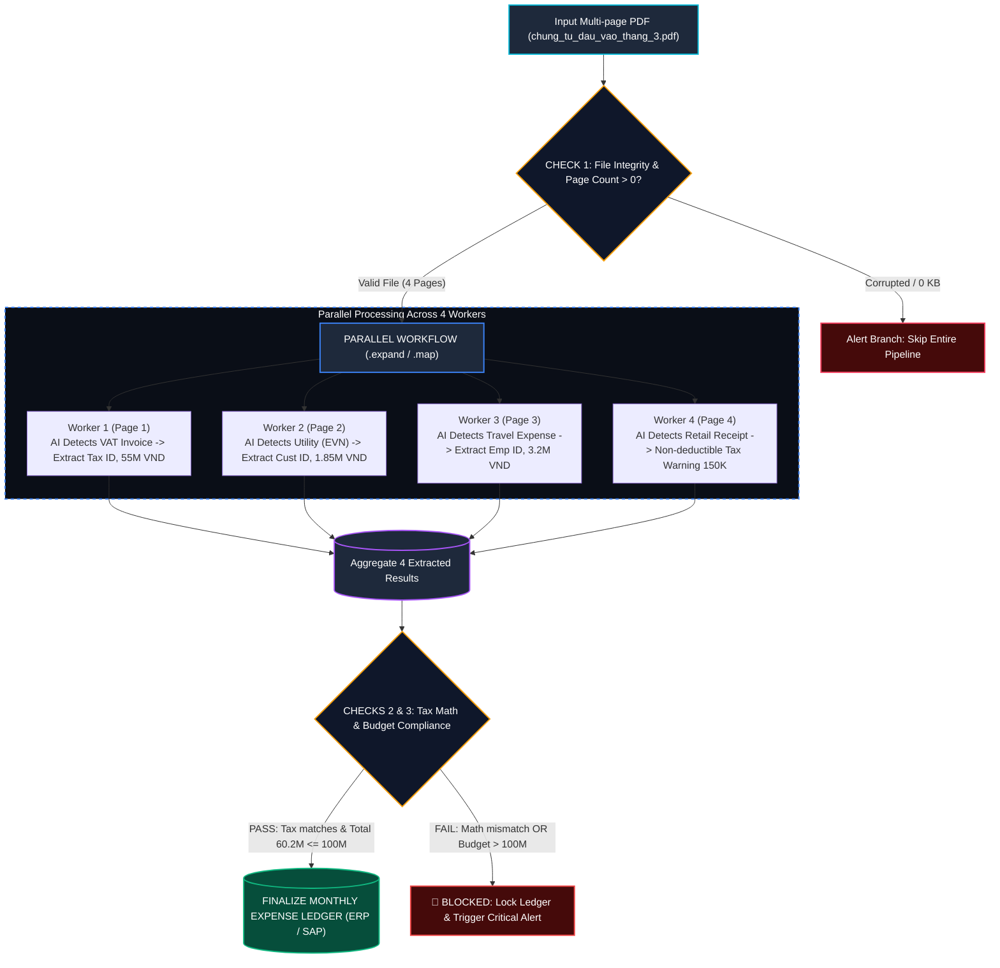

# 📖 TÀI LIỆU DỰ ÁN: XỬ LÝ FILE PDF ĐA HÓA ĐƠN (AIRFLOW VS. DAGSTER)

---

## 🎯 1. BÀI TOÁN KINH DOANH CHUNG (100% UNIFIED SCENARIO)

### 💡 Bối cảnh dự án
Hàng tháng, phòng Kế toán & Tài chính tiếp nhận **1 tệp PDF tổng hợp chứa nhiều hóa đơn chứng từ đầu vào** (`chung_tu_dau_vao_thang_3.pdf`).

Thay vì bóc tách thủ công, hệ thống cần tự động:
1. **Phân tách các trang PDF** và chạy **Vòng lặp song song 100%** qua từng trang.
2. **AI nhận diện loại hóa đơn & Rẽ nhánh bóc tách chuyên biệt** ngay trong từng worker:
   - **Trang 1 (VAT)**: Bóc tách MST 0101234567, Tiền gốc 50tr + VAT 5tr = **55.000.000 VNĐ** (Khấu trừ thuế: CÓ).
   - **Trang 2 (Tiện ích EVN)**: Bóc tách Mã KH PE0100098765, Tiền điện = **1.850.000 VNĐ** (Khấu trừ thuế: CÓ).
   - **Trang 3 (Công tác phí)**: Bóc tách Vé máy bay NV-889 Nguyễn Văn A = **3.200.000 VNĐ** (Khấu trừ thuế: CÓ).
   - **Trang 4 (Biên lai bán lẻ)**: Bóc tách Mua trà cà phê tiếp khách = **150.000 VNĐ** (Khấu trừ thuế: KHÔNG - Cảnh báo).
3. **Thực hiện 3 Chốt Chặn Kiểm Định (Checks)**:
   - **Check 1 (File Integrity)**: Kiểm tra file PDF hợp lệ, có số trang $> 0$.
   - **Check 2 (VAT Math)**: Kiểm tra công thức thuế GTGT ($\text{Tổng thanh toán} == \text{Tiền trước thuế} + \text{VAT}$).
   - **Check 3 (Budget Limit Compliance - BLOCKING)**: Tổng chi phí $\le 100.000.000\text{ VNĐ}$ và không có số tiền âm.
4. **Chốt Sổ Cái Chi Phí Tháng** và đẩy vào hệ thống ERP / SAP:
   - **Tổng chi phí**: **$60.200.000\text{ VNĐ}$**
   - **Thuế VAT được khấu trừ**: **$5.000.000\text{ VNĐ}$**

---

## 🔄 2. SƠ ĐỒ LUỒNG THỰC THI (PARALLEL DYNAMIC ROUTING)



---

## ⚖️ 3. SO SÁNH 2 GÓC NHÌN TRÊN CÙNG MỘT BÀI TOÁN

```text
               ┌──────────────────────────────────────────────────────────┐
               │         CÙNG 1 BÀI TOÁN: XỬ LÝ FILE PDF HÓA ĐƠN          │
               │         (chung_tu_dau_vao_thang_3.pdf - 4 trang)         │
               └────────────────────────────┬─────────────────────────────┘
                                            │
           ┌────────────────────────────────┴────────────────────────────────┐
           ▼                                                                 ▼
┌──────────────────────────────────────┐          ┌──────────────────────────────────────┐
│  GÓC NHÌN 1: APACHE AIRFLOW          │          │  GÓC NHÌN 2: DAGSTER                 │
│  (TASK-CENTRIC / PIPELINE AS TASKS)  │          │  (DATA-CENTRIC / PIPELINE AS ASSETS) │
├──────────────────────────────────────┤          ├──────────────────────────────────────┤
│ 📂 File:                              │          │ 📂 File:                              │
│ airflow_demo/dags/                   │          │ dagster_demo/invoice_processing/     │
│ invoice_multipage_pdf_dag.py         │          │ assets.py                            │
│                                      │          │                                      │
│ 🛠️ Triển khai:                       │          │ 🛠️ Triển khai:                       │
│ 1. Ingest PDF                        │          │ 1. Asset: raw_multipage_invoice_pdf  │
│ 2. Check 1: @task.branch             │          │ 2. Check 1: @asset_check             │
│    (check_pdf_integrity)             │          │    (check_pdf_file_integrity)        │
│ 3. Router phân loại 4 nhóm trang     │          │ 3. Asset: extracted_invoice_pages    │
│ 4. 4 Task song song (.expand()):     │          │ 4. 4 Asset song song (xóa if/else):  │
│    - extract_vat_invoice             │          │    - vat_invoices                    │
│    - extract_utility_invoice         │          │    - utility_invoices                │
│    - extract_reimbursement_invoice   │          │    - reimbursement_invoices          │
│    - extract_invalid_invoice         │          │    - invalid_invoices                │
│ 5. Gom kết quả (collect_invoices)    │          │ 5. Asset: categorized_invoices (Gom) │
│ 6. Check 2 & 3: @task.branch         │          │ 6. Check 2: @asset_check thuế VAT    │
│    (audit_financial_budget)          │          │ 7. Check 3: @asset_check(blocking)   │
│ 7. Chốt sổ cái:                      │          │ 8. Asset: monthly_expense_ledger     │
│    lock_and_publish_financial_ledger │                                                 │
│                                      │ 🎯 Ưu điểm vượt trội:                   │
│ 🎯 Ưu điểm vượt trội:                │ • 4 nhánh song song hiển thị trực quan  │
│ • 4 nhánh rẽ song song trên Graph UI │ • Xóa bỏ hoàn toàn if/else thủ công     │
│ • Điều phối worker song song 100%    │ • Chốt chặn blocking tự động khóa luồng │
│ • Mở rộng N trang không cần sửa code │ • Data Catalog xem trực tiếp metadata   │
└──────────────────────────────────────┘          └──────────────────────────────────────┘
```

---

## 🔬 4. PHÂN TÍCH CHUYÊN SÂU CƠ CHẾ VẬN HÀNH (UNDER THE HOOD)

### 4.1. Cách Apache Airflow Vận Hành (Task-Centric Execution)
Airflow xem thế giới như một **chuỗi các đầu việc cần làm (What to do)**:

1. **DAG Parsing & Scheduling**:
   - `Airflow Scheduler` liên tục quét thư mục DAGs, dịch mã Python thành cấu trúc Task DAG và lưu metadata vào DB (Postgres/MySQL).
   - Khi trigger, Scheduler tạo một bản ghi `DagRun`, sau đó lập lịch cho từng `TaskInstance` theo thứ tự phụ thuộc.
2. **Cơ chế Song song bằng Dynamic Task Mapping (`.expand()`):**
   - Task `route_and_dispatch_pages` bóc tách file PDF và phân loại ra 4 danh sách: `vat_pages`, `utility_pages`, `reimbursement_pages`, `invalid_pages`.
   - Các task `extract_vat_invoice.expand(page=...)` nhận mảng đầu vào và sinh ra các **Mapped Task Instances** chạy song song trên Worker (Celery/K8s Pods).
3. **Cơ chế Truyền dữ liệu (XCom):**
   - Kết quả trả về từ `return` của Python function được tự động serialize thành JSON và ghi vào bảng `xcom` trong cơ sở dữ liệu Metadata của Airflow.
   - ⚠️ *Hạn chế*: XCom không được thiết kế cho dữ liệu lớn (Big Data/File PDF dung lượng lớn). Nếu payload vượt vài MB, Metadata DB sẽ bị nghẽn (Bottleneck).
4. **Cơ chế Gom kết quả & Trigger Rule:**
   - Khi các nhánh song song hoàn thành, task gom `collect_extracted_invoices` sử dụng `trigger_rule=TriggerRule.NONE_FAILED_MIN_ONE_SUCCESS`. Điều này giúp pipeline tiếp tục chạy ngay cả khi một số nhánh không có dữ liệu (0 trang) bị skip.
5. **Cơ chế Kiểm định chất lượng:**
   - Dùng `@task.branch`: Phải tự viết logic if/else để quyết định return về `task_id` hợp lệ hay rẽ sang nhánh cảnh báo/thất bại.

---

### 4.2. Cách Dagster Vận Hành (Data/Asset-Centric Execution)
Dagster xem thế giới như một **đồ thị các tài sản dữ liệu cần được tạo ra (What to produce)**:

1. **Software-Defined Assets (SDA):**
   - Mỗi hàm `@asset` định nghĩa một bảng dữ liệu hoặc tài sản dữ liệu cụ thể (`raw_multipage_invoice_pdf`, `vat_invoices`, `monthly_financial_expense_ledger`).
   - Dagster tự động phân tích tham số hàm (`def categorized_invoices(vat_invoices, utility_invoices, ...)`) để tự vẽ nên **Asset Lineage Graph** mà lập trình viên không cần nối dây `>>` thủ công.
2. **Cơ chế Thực thi (Materialization & Parallel Execution):**
   - Khi bấm **Materialize**, Dagster Engine phân tích đồ thị: Nhận thấy `vat_invoices`, `utility_invoices`, `reimbursement_invoices`, `invalid_invoices` cùng phụ thuộc vào `extracted_invoice_pages` và độc lập với nhau, engine tự động phân bổ chúng chạy **song song đa tiến trình (Multiprocess)** hoặc tạo các **K8s Pods riêng biệt**.
3. **Cơ chế Quản lý Dữ liệu (I/O Manager):**
   - Khác với XCom của Airflow, Dagster tách biệt hoàn toàn giữa **Compute Logic** và **Storage**:
     - Trong môi trường Dev: Dữ liệu được truyền qua in-memory hoặc lưu file parquet/pickle cục bộ.
     - Trong môi trường Production: Chỉ cần cấu hình `s3_pickle_io_manager` hoặc `snowflake_io_manager`, dữ liệu tự động lưu trữ lên S3/Warehouse mà không cần sửa 1 dòng code logic nào!
4. **Cơ chế Kiểm định Hạng Nhất (@asset_check & Blocking):**
   - Dagster có sẵn khái niệm **Asset Check** độc lập với logic biến đổi dữ liệu.
   - Hỗ trợ tham số `blocking=True`: Khi chốt chặn Check 3 (Hạn mức ngân sách <= 100M) bị vi phạm, Dagster **ngắt cầu dao ngay tại chỗ**, ngăn chặn hoàn toàn việc ghi dữ liệu vào bảng `monthly_financial_expense_ledger` hạ lưu mà không làm sập (crash) hệ thống.
5. **Data Catalog & Metadata Trực quan:**
   - Mỗi lần chạy, Dagster ghi lại metadata phong phú: Số trang, số tiền thuế VAT, tổng chi phí, preview JSON... Người dùng có thể tra cứu lịch sử chất lượng dữ liệu ngay trên Catalog UI.

---

## ⚖️ 5. BẢNG SO SÁNH ĐA CHIỀU CHI TIẾT

| Tiêu chí | Apache Airflow (Task-Centric) | Dagster (Asset-Centric) | Đánh giá & Khuyến nghị |
| :--- | :--- | :--- | :--- |
| **Triết lý cốt lõi** | "Chạy Task A rồi chạy Task B" (Workflow Orchestrator) | "Dữ liệu X được tạo ra từ Dữ liệu Y" (Data Asset Orchestrator) | Dagster phản ánh chính xác tư duy Data Engineering hiện đại |
| **Cách tổ chức Code** | Viết DAG, Operator, nối luồng bằng `>>` hoặc TaskFlow API | Viết hàm `@asset`, truyền tên asset vào tham số hàm | Dagster viết code như Python thông thường, ít boilerplate |
| **Truyền dữ liệu (Data Passing)** | XCom (Ghi vào Postgres DB - Giới hạn dung lượng, dễ nghẽn DB) | I/O Manager (Lưu S3, GCS, Blob, Parquet, Database linh hoạt) | Dagster vượt trội khi xử lý bảng dữ liệu trung bình và lớn |
| **Kiểm định dữ liệu (Data Quality)** | Phải tự chế Task kiểm tra, rẽ nhánh hoặc raise Exception | First-class `@asset_check` (Hỗ trợ `blocking=True`, Severity, SLAs) | Dagster chuyên biệt hóa cho kiểm soát chất lượng dữ liệu |
| **Hiển thị Rẽ nhánh (Branching)** | Cần tách nhỏ task hoặc dùng Dynamic Mapping để thấy trên Graph UI | Tự động phân nhánh song song trực quan theo Asset Lineage | Cả hai đều hiển thị rõ ràng 4 nhánh song song |
| **Khả năng Unit Test** | Rất khó test nếu không dựng Docker/Airflow DB để mock XCom | Cực kỳ dễ: Gọi hàm như Python thông thường hoặc dùng `materialize()` | Dagster dễ viết test tự động CI/CD hơn rất nhiều (100% testable) |
| **Khả năng quan sát (Observability)** | Xem log của Task, biểu đồ Gantt, thời gian chạy Task | Xem Data Catalog, Schema, Lineage, Metadata, Lịch sử kiểm định | Dagster cung cấp góc nhìn toàn diện cho cả Dev & Data Consumer |
| **Khôi phục lỗi & Backfill** | Phải Re-run lại cả DAG Run hoặc Clear Task thủ công | Chỉ cần Re-materialize đúng Asset bị lỗi hoặc stale | Dagster tiết kiệm tài nguyên tính toán khi sửa lỗi |
| **Hệ sinh thái & Cộng đồng** | Khổng lồ (ra đời từ 2014), hàng ngàn Provider kết nối | Đang phát triển cực nhanh, hiện đại, tối ưu cho Cloud/K8s | Airflow mạnh về legacy & DevOps; Dagster mạnh về Data Platform |

---

## 🏛️ 6. ĐÁNH GIÁ THAY THẾ AWS STEP FUNCTIONS TRÊN ON-PREMISE / K8S

Doanh nghiệp muốn chuyển đổi từ **AWS Step Functions** sang On-Premise/K8s:

### 1. Đối chiếu tính năng với AWS Step Functions:
| Tính năng Step Functions | Giải pháp tương ứng trên Airflow | Giải pháp tương ứng trên Dagster |
| :--- | :--- | :--- |
| **Task State** | PythonOperator / `@task` | `@asset` |
| **Map State (Vòng lặp song song)** | Dynamic Task Mapping (`.expand()`) | Parallel Multi-Asset Materialization |
| **Choice State (Rẽ nhánh điều kiện)** | `@task.branch` | Tách các `@asset` chuyên biệt |
| **Catch / Error Handling** | TriggerRule / `on_failure_callback` | `@asset_check(blocking=True)` / Retry Policy |
| **Execution History / Visual** | Graph View / Grid View | Asset Lineage / Run Timeline |

### 2. Khi nào nên chọn hệ thống nào?
* **Chọn APACHE AIRFLOW nếu:**
  - Hệ thống thiên về **điều phối hạ tầng & công việc thuần túy** (chạy script Bash, kích hoạt Spark job, trigger dbt, sao lưu database định kỳ).
  - Đội ngũ đã có sẵn kinh nghiệm vận hành Airflow, hạ tầng Kubernetes đã cấu hình CeleryExecutor hoặc KubernetesExecutor.
  - Pipeline không yêu cầu quản lý phiên bản dữ liệu và cataloging chuyên sâu.
* **Chọn DAGSTER nếu:**
  - Mục tiêu cốt lõi là **xây dựng nền tảng dữ liệu (Data Platform) & AI/ML Pipeline**.
  - Cần kiểm soát chặt chẽ **chất lượng dữ liệu (Data Quality)** với các chốt chặn tự động khóa luồng (Blocking Checks).
  - Đội ngũ muốn khả năng **viết Unit Test 100% trong CI/CD**, phát triển nhanh trên máy cục bộ (Local Dev) mà không cần cấu hình cụm máy chủ cồng kềnh.
  - Cần một **Data Catalog tích hợp sẵn** để Kế toán, Data Analyst, BI tra cứu trực tiếp nguồn gốc và metadata dữ liệu.

---

## 📊 7. ĐỐI CHIẾU KẾT QUẢ ĐẦU RA (GIỐNG NHAU 100%)

| Chỉ số tổng kết | Apache Airflow | Dagster |
| :--- | :---: | :---: |
| **Tổng số trang xử lý** | 4 trang | 4 trang |
| **Tổng chi phí phê duyệt** | **60.200.000 VNĐ** | **60.200.000 VNĐ** |
| **Tổng tiền thuế VAT được khấu trừ** | **5.000.000 VNĐ** | **5.000.000 VNĐ** |
| **Số hóa đơn hợp lệ khấu trừ** | 3 hóa đơn | 3 hóa đơn |
| **Số chứng từ bị cảnh báo loại trừ thuế** | 1 biên lai (150.000 VNĐ) | 1 biên lai (150.000 VNĐ) |
| **Kết quả kiểm toán tài chính** | ✅ PASSED & LOCKED | ✅ AUDITED_AND_COMPLIANT |

---

## 🚀 8. HƯỚNG DẪN CHẠY VÀ KIỂM THỬ THỰC TẾ

### 1. Khởi động Dagster Web UI (Cổng 3000)
```bash
./run_dagster_dev.sh
```
* Mở trình duyệt: `http://localhost:3000`
* Nhấp vào menu **Assets** ➔ Xem đồ thị **Asset Lineage** với 4 nhánh rẽ song song.
* Bấm **Materialize all** để chạy trọn vẹn quy trình và theo dõi 3 chốt chặn `@asset_check`.

### 2. Khởi động Airflow Web UI (Cổng 8080)
```bash
./run_airflow_standalone.sh
```
* Mở trình duyệt: `http://localhost:8080` (Tài khoản: `admin` / Mật khẩu: `qWG7XMuYzxgAvGhq`).
* Tìm DAG `invoice_multipage_pdf_airflow_dag`, bật **Active** và bấm **Trigger DAG** (▶️).
* Xem tab **Graph View** để thấy 4 nhánh bóc tách chuyên biệt rẽ nhánh song song và hội tụ về task gom kết quả.

### 3. Chạy Toàn Bộ Bộ Kiểm Thử Tự Động (Unit Tests)
```bash
PYTHONPATH=. pytest dagster_demo/tests/ -v
```
*(Đạt chuẩn 4/4 tests passed 100% bao gồm cả test kiểm định ngăn chặn vi phạm ngân sách).*

