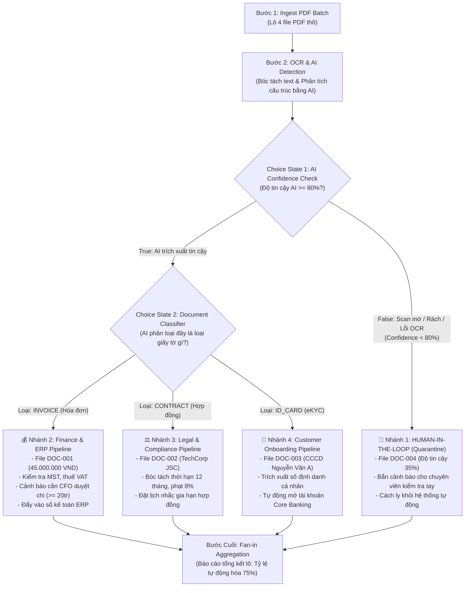

# 📖 TÀI LIỆU DỰ ÁN: PIPELINE XỬ LÝ TÀI LIỆU THÔNG MINH (OCR & AI DOCUMENT PROCESSING)
### Mô Phỏng Kiến Trúc AWS Step Functions Trên On-Premise (Airflow vs Dagster)

---

## 🎯 1. BÀI TOÁN KINH DOANH: INTELLIGENT DOCUMENT PROCESSING (IDP)

### 💡 Bối cảnh dự án
Trong các doanh nghiệp hiện đại (Tài chính, Ngân hàng, Bảo hiểm, Logistics), hàng ngày có hàng nghìn file tài liệu PDF được tải lên từ khách hàng và đối tác:
* Hóa đơn đỏ VAT cần thanh toán.
* Hợp đồng kinh tế cần pháp chế rà soát.
* Căn cước công dân (CCCD) để mở tài khoản khách hàng (eKYC).
* Các file scan bị mờ, rách hoặc lỗi font chữ không đọc được.

Trước đây, quy trình này thường chạy trên **AWS Step Functions** kết nối S3, AWS Textract và Lambda. Dự án này xây dựng giải pháp **chuyển dịch về On-Premise / Kubernetes**, so sánh trực quan giữa **Apache Airflow** và **Dagster**.

### 🎯 Trọng tâm so sánh:
1. **Dynamic Task Mapping / Fan-out**: Cách nhận lô nhiều tài liệu và chia nhỏ để chạy song song.
2. **Choice State (Rẽ nhánh điều kiện)**: Phân loại tài liệu bằng AI để rẽ vào các hệ thống chuyên biệt (ERP Kế toán, Kho Pháp chế, Core Banking eKYC).
3. **Data Quality Gate / Exception Handling**: Phát hiện các file scan mờ, độ tin cậy AI thấp (< 80%) để kích hoạt cơ chế cách ly kiểm tra tay (**Human-In-The-Loop**).
4. **Fan-in Aggregation**: Báo cáo tổng kết tỷ lệ tự động hóa thành công của lô tài liệu.

---

## 🔄 2. CHI TIẾT LUỒNG NGHIỆP VỤ (STEP-BY-STEP WORKFLOW)



### 📄 Dữ liệu 4 file PDF mẫu trong Batch:
1. **`DOC-001` (`hoa_don_vat_dich_vu_cloud.pdf`)**: Hóa đơn đỏ VAT, 45,000,000 VND. AI Confidence: `96%`.
2. **`DOC-002` (`hop_dong_hop_tac_techcorp.pdf`)**: Hợp đồng kinh tế đối tác TechCorp, 12 tháng. AI Confidence: `92%`.
3. **`DOC-003` (`can_cuoc_cong_dan_nguyen_van_a.pdf`)**: Căn cước công dân Nguyễn Văn A. AI Confidence: `98%`.
4. **`DOC-004` (`bien_lai_scan_mo_rach.pdf`)**: File scan mờ, văn bản bị vỡ hạt. AI Confidence: `35%` (Thấp < 80%).

---

## ⚙️ 3. APACHE AIRFLOW LÀM GÌ TRONG DỰ ÁN NÀY?

* **File nguồn**: `airflow_demo/dags/order_processing_dag.py` (`document_processing_ai_dag`)
* **Triết lý**: **Task-Driven** — Điều phối luồng hành động bằng `@task.branch`.

### Cách Airflow giải quyết bài toán:
1. **Tiếp nhận Lô tài liệu**: Task `ingest_pdf_batch()` nhận 4 tài liệu PDF.
2. **Choice State (@task.branch)**:
   Hàm `ai_routing_choice_state` phân tích kết quả AI và trả về danh sách task cần kích hoạt:
   * Trả về `"quarantine_for_human_review"` cho file scan mờ.
   * Trả về `"process_invoice_erp"` cho hóa đơn.
   * Trả về `"process_contract_legal"` cho hợp đồng.
   * Trả về `"process_ekyc_identity"` cho căn cước.
3. **Giao diện Airflow Web UI (`http://localhost:8080`)**:
   * Nhánh nào có file thỏa mãn sẽ sáng đèn xanh (**SUCCESS**).
   * Nhánh nào không có file sẽ mang trạng thái **SKIPPED (màu hồng)**.
4. **Fan-in Aggregation**: Task `aggregate_document_batch_summary` gom toàn bộ kết quả với `trigger_rule=TriggerRule.NONE_FAILED_MIN_ONE_SUCCESS`.

---

## 💎 4. DAGSTER LÀM GÌ TRONG DỰ ÁN NÀY?

Dagster cung cấp 2 góc nhìn:

### 🅰️ Cách 1: Mô hình Ops & Jobs (Tương thích 1-1 với Step Functions)
* **File nguồn**: `dagster_demo/order_processing/ops_workflow.py` (`document_processing_job`)
* **Cách thực hiện**:
  - Dùng `fan_out_documents` với `DynamicOut()` để loop song song qua 4 file PDF.
  - Op `ocr_and_ai_detect_document` thực hiện OCR và phân luồng Choice State.
  - Op `aggregate_document_results` gom toàn bộ kết quả (`processed.collect()`).

---

### 🅱️ Cách 2: Triết lý Hiện đại của Dagster — Software-Defined Assets (SDA)
* **File nguồn**: `dagster_demo/order_processing/assets_workflow.py`
* **Triết lý**: **Data-Driven & AI Governance** — Quản lý theo vòng đời tài nguyên dữ liệu và chất lượng AI.

1. **Asset 1 (`raw_pdf_batch`)**: Bảng chứa danh sách file PDF thô.
2. **Asset 2 (`ai_extracted_documents`)**: Dữ liệu sau khi qua OCR và mô hình AI trích xuất trường JSON.
3. **Asset Check (`@asset_check`) — Điểm sáng độc quyền**:
   * Hàm `check_ai_confidence_quality` kiểm tra điều kiện `ai_confidence >= 80%`.
   * Vì phát hiện `DOC-004` chỉ có 35% độ tin cậy, Dagster tự động hiển thị **Huy hiệu Cảnh báo (Badge WARN)** trực tiếp trên giao diện Data Catalog!
4. **Đồ thị rẽ nhánh 4 Asset Marts chuyên biệt**:
   * `finance_invoices_mart`: Bảng dữ liệu hóa đơn (Tổng tiền 45,000,000 VND).
   * `legal_contracts_mart`: Bảng dữ liệu hợp đồng.
   * `ekyc_identities_mart`: Bảng dữ liệu căn cước công dân.
   * `quarantined_unreadable_docs`: Bảng cách ly tài liệu lỗi để chuyên viên mở ra xem xét.
5. **Fan-in Asset (`document_batch_summary`)**:
   * Hội tụ toàn bộ 4 bảng con để tính toán: Tỷ lệ tự động hóa thành công (**75.0%**), tổng tiền hóa đơn đã trích xuất.

---

## 📊 5. BẢNG SO SÁNH TỔNG QUAN

| Tiêu chí | AWS Step Functions (Gốc) | Apache Airflow (Triển khai) | Dagster (Triển khai) |
| :--- | :--- | :--- | :--- |
| **Loại hình kiến trúc** | Serverless Cloud Orchestrator | Task-Driven Orchestrator | Data-Driven Asset Orchestrator |
| **Khai báo luồng** | JSON / Amazon States Language | Code Python thuần (`@dag`, `@task`) | Code Python thuần (`@asset` hoặc `@op`) |
| **Rẽ nhánh (Choice)** | Choice State | `@task.branch` điều hướng task | Phân nhánh Data Marts chuyên biệt |
| **Quản trị chất lượng AI**| Viết Lambda custom check | Viết logic if/else trong task | **`@asset_check` gắn huy hiệu UI trực quan** |
| **Xử lý tài liệu mờ** | Gọi SNS/SQS cảnh báo | Rẽ nhánh task `human_review` | Đưa vào bảng `quarantined_unreadable_docs` |
| **Truyền dữ liệu trích xuất**| JSON Payload qua state | `XCom` (lưu trong DB) | In/Out type-checked & `IOManager` |
| **Unit Test cục bộ** | Rất khó | Phức tạp (Cần Airflow Context) | **Rất dễ dàng** với `pytest` |
| **Data Lineage & Catalog**| Không có sẵn | Không chuyên sâu | **Tích hợp sẵn & trực quan 100%** |

---

## 🚀 6. HƯỚNG DẪN THAO TÁC THỰC HÀNH

### 1. Khởi động Airflow UI (Cổng 8080)
```bash
./run_airflow_standalone.sh
```
* Mở trình duyệt: `http://localhost:8080`
* Bật DAG `document_processing_ai_dag` và bấm **Trigger DAG** (▶️) để xem các nhánh rẽ nghiệp vụ.

### 2. Khởi động Dagster UI (Cổng 3000)
```bash
./run_dagster_dev.sh
```
* Mở trình duyệt: `http://localhost:3000`
* Xem tab **Lineage** để thấy sơ đồ cây từ file thô rẽ sang 4 bảng dữ liệu và hội tụ về báo cáo tổng kết.
* Xem huy hiệu màu cam **1 Check Warning** cảnh báo file scan mờ `DOC-004`!
* Bấm **Materialize all** để chạy cập nhật dữ liệu.

### 3. Chạy Unit Test kiểm tra logic
```bash
PYTHONPATH=. .venv/bin/pytest dagster_demo/tests/test_order_processing.py
```
*(Kết quả kiểm thử 100% passed).*
