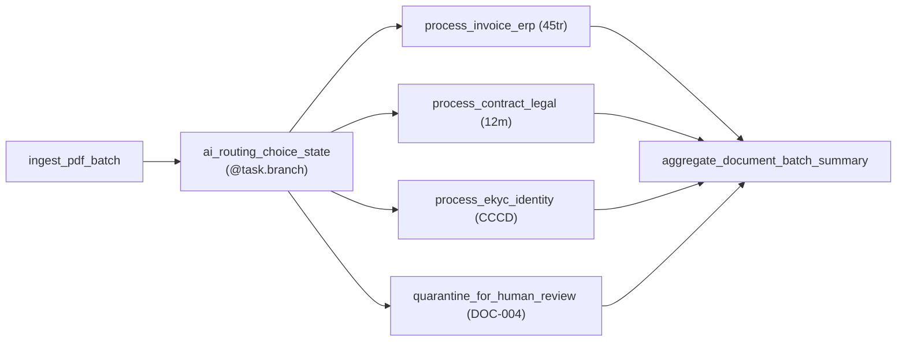
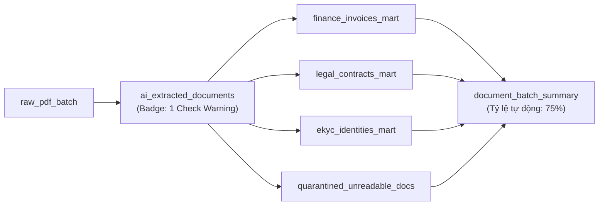

# 🎤 KỊCH BẢN THUYẾT TRÌNH & HƯỚNG DẪN LIVE DEMO CHI TIẾT
## Chủ Đề: Chuyển Dịch Workflow Orchestration Từ AWS Step Functions Sang On-Premise
### Bài Toán Thực Chiến: Intelligent Document Processing (OCR & AI Pipeline)

---

## 📋 THÔNG TIN TỔNG QUAN

* **Đối tượng người nghe:** CTO, Head of Engineering, Tech Lead, Data Architect, Data/AI Engineers, DevOps/SRE.
* **Thời lượng dự kiến:** 30 – 45 phút (Bao gồm 20 phút thuyết trình + Demo thực tế, 15 phút Q&A).
* **Môi trường Demo trực tiếp:**
  * **Apache Airflow Web UI:** `http://localhost:8080` (DAG: `document_processing_ai_dag`)
  * **Dagster Web UI:** `http://localhost:3000` (Tab: `Lineage` & `Catalog`, Job: `document_processing_job`)

---

## 🎯 PHẦN 1: MỞ ĐẦU & BỐI CẢNH DỰ ÁN (2 Phút)

### 🎙️ Lời Thoại Diễn Giả (Speaker Script):
> *"Kính thưa các anh chị và các bạn đồng nghiệp,
> 
> Trong giai đoạn chuyển dịch hạ tầng từ Cloud (AWS) về **On-Premise / Private Cloud (Kubernetes)** nhằm tự chủ dữ liệu và tối ưu chi phí vận hành, một trong những thách thức kỹ thuật lớn nhất là: **Tìm giải pháp thay thế cho AWS Step Functions**.
> 
> Để đưa ra quyết định kiến trúc chính xác nhất giữa 2 ứng cử viên mã nguồn mở hàng đầu hiện nay là **Apache Airflow** và **Dagster**, nhóm chúng em đã xây dựng một hệ thống PoC thực chiến trên một bài toán cực kỳ thời thượng và điển hình của doanh nghiệp: **Intelligent Document Processing (IDP) — Pipeline xử lý tài liệu thông minh kết hợp OCR và AI**.
> 
> Hôm nay, em xin phép trình bày kiến trúc, phân tích mã nguồn và thực hiện **Live Demo trực tiếp trên giao diện của cả 2 nền tảng** để cùng các anh chị đánh giá trực quan."*

---

## 📑 PHẦN 2: BÀI TOÁN NGHIỆP VỤ & TẬP DỮ LIỆU ĐẦU VÀO (3 Phút)

### 🔍 Giải Thích Nghiệp Vụ:
Mỗi ngày, hệ thống tiếp nhận hàng loạt file tài liệu PDF từ khách hàng và đối tác qua cổng thông tin. Lô thử nghiệm gồm **4 tài liệu tiêu biểu**:

1. **`DOC-001.pdf` (Hóa đơn đỏ VAT)**:
   * AI trích xuất: Cty TNHH Dịch Vụ Mây, MST `0101234567`, Tổng tiền `45.000.000 VND`.
   * Độ tin cậy AI (Confidence): **`96%`**.
   * *Nghiệp vụ:* Cần phê duyệt chi (vì $\ge$ 20 triệu) và đẩy vào sổ kế toán ERP (Oracle/SAP).
2. **`DOC-002.pdf` (Hợp đồng kinh tế)**:
   * AI trích xuất: Đối tác TechCorp JSC, thời hạn 12 tháng, điều khoản phạt 8%.
   * Độ tin cậy AI: **`92%`**.
   * *Nghiệp vụ:* Lưu trữ kho Pháp chế (Legal Vault) và đặt lịch cảnh báo gia hạn tự động.
3. **`DOC-003.pdf` (Căn cước công dân - eKYC)**:
   * AI trích xuất: Họ tên Nguyễn Văn A, số CCCD `001201009999`, năm sinh 1995.
   * Độ tin cậy AI: **`98%`**.
   * *Nghiệp vụ:* Tự động kích hoạt tài khoản thanh toán trên Core Banking.
4. **`DOC-004.pdf` (File scan mờ / rách / lỗi font)**:
   * AI phản hồi: Văn bản vỡ hạt, không nhận diện được cấu trúc.
   * Độ tin cậy AI: **`35%` (Thấp < 80%)**.
   * *Nghiệp vụ:* Kích hoạt cơ chế **Human-In-The-Loop** — Cách ly lập tức để nhân viên kiểm tra tay.

---

## 🚀 PHẦN 3: LIVE DEMO & PHÂN TÍCH APACHE AIRFLOW (10 Phút)

### 🖥️ Thao Tác Trình Chiếu:
1. Mở trình duyệt tại: `http://localhost:8080`.
2. Chọn DAG: **`document_processing_ai_dag`**.
3. Chuyển sang tab **Graph View** (hoặc Grid View).
4. Nhấn nút **Trigger DAG (▶️)** để quan sát luồng chạy trực tiếp.



### 🎙️ Lời Thoại Thuyết Minh Trên Giao Diện:
> *"Xin mời các anh chị quan sát trên giao diện **Graph View** của Airflow:
>
> 1. **Mô hình tư duy (Mental Model):**
>    Airflow tư duy theo hướng **Task-Driven** (Tập trung vào chuỗi hành động `A >> B >> C`).
> 2. **Choice State trên Airflow (`@task.branch`):**
>    * Node `ai_routing_choice_state` đóng vai trò là Choice State của Step Functions.
>    * Khi chạy, hàm Python phân tích kết quả AI và trả về danh sách các task ID cần thực thi.
> 3. **Quan sát màu sắc trực quan:**
>    * Các nhánh có tài liệu tương ứng đều chuyển sang **Màu Xanh Lá (SUCCESS)**.
>    * File `DOC-004` (độ tin cậy 35%) được điều hướng chính xác vào task `quarantine_for_human_review`.
>    * Nếu một đợt chạy **không có hợp đồng nào**, nhánh `process_contract_legal` sẽ chuyển sang **Màu Hồng (SKIPPED)**.
> 4. **Gom kết quả (Fan-in Aggregation):**
>    * Để gom kết quả từ các nhánh rẽ mà không bị lỗi, ta sử dụng:
>      `trigger_rule = TriggerRule.NONE_FAILED_MIN_ONE_SUCCESS`."*

### 💻 Điểm Nhấn Mã Nguồn [airflow_demo/dags/order_processing_dag.py](file:///home/duc/SelftTraining/Airflow_Dagster/airflow_demo/dags/order_processing_dag.py):
```python
@task.branch
def ai_routing_choice_state(doc_batch: List[Dict[str, Any]]) -> List[str]:
    active_routes = set()
    for doc in doc_batch:
        conf = doc.get("confidence", 0.0)
        doc_type = doc.get("ai_detected_type", "")
        if conf < 0.80:
            active_routes.add("quarantine_for_human_review")
        elif doc_type == "INVOICE":
            active_routes.add("process_invoice_erp")
        ...
    return list(active_routes)
```

### ⚠️ Hạn Chế Cốt Lõi Của Airflow Cần Nêu Ra:
1. **Dữ liệu truyền qua XCom:** Lưu trực tiếp vào Database PostgreSQL của Airflow. Không phù hợp để truyền file PDF lớn hoặc bảng dữ liệu hàng triệu dòng.
2. **Thiếu Data Lineage gốc:** Airflow chỉ quản lý trạng thái task (Done/Fail), hoàn toàn không biết bên trong bảng dữ liệu nào đang được sinh ra hay bị lỗi.

---

## 💎 PHẦN 4: LIVE DEMO & PHÂN TÍCH DAGSTER (15 Phút) - "NGÔI SAO SÁNG"

### 🖥️ Thao Tác Trình Chiếu:
1. Mở trình duyệt tại: `http://localhost:3000`.
2. Bấm vào mục **Lineage** trên thanh điều hướng bên trái.
3. Nhấn **Materialize all** để xem toàn bộ pipeline chạy cập nhật.



---

### 🌟 4 Điểm Đột Phá Cần Chỉ Rõ Trên Dagster UI:

#### 1. Triết Lý Software-Defined Assets (SDA) — Data-Centric
> *"Các anh chị nhìn vào tab **Lineage**:
> Thay vì các ô chữ nhật vô hồn thể hiện tên hàm, Dagster vẽ ra **Sơ đồ phả hệ của chính các Tài sản Dữ liệu (Assets)**.
> * Từ nguồn thô `raw_pdf_batch` $\rightarrow$ qua bước trích xuất `ai_extracted_documents`.
> * Tự động rẽ nhánh thành **4 Data Marts chuyên biệt cho từng phòng ban**: Bảng Tài chính, Bảng Pháp chế, Bảng eKYC, và Bảng kiểm toán tài liệu lỗi.
> * Cuối cùng hội tụ về **`document_batch_summary`**."*

#### 2. Tính Năng Signature `@asset_check` (Hàng Rào Kiểm Định AI)
* **Thao tác:** Click vào node `ai_extracted_documents`, chỉ vào **Huy hiệu Cảnh báo màu vàng/cam (Badge `1 Check Warning`)**, mở tab **Checks**:

> *"Đây là tính năng độc quyền vượt trội nhất của Dagster so với cả Airflow lẫn AWS Step Functions:
> * Chúng em khai báo hàm `@asset_check`: Kiểm tra độ tin cậy AI phải $\ge 80\%$.
> * Khi quét trúng file scan mờ `DOC-004` (chỉ đạt 35%), Dagster **ngay lập tức gắn huy hiệu cảnh báo trực tiếp trên Asset Catalog**.
> * Kỹ sư vận hành và ban quản lý không cần phải đọc từng dòng log terminal; nhìn vào giao diện là thấy ngay tài liệu nào có nguy cơ lỗi."*

#### 3. Báo Cáo Metadata Ngay Trên Giao Diện (Không Cần Truy Vấn DB)
* **Thao tác:** Click vào node **`document_batch_summary`** $\rightarrow$ nhìn panel bên phải:
  * `automation_rate`: **`75.0%`** (3/4 file xử lý tự động hoàn toàn).
  * `total_invoice_vnd`: **`45,000,000 VND`**.
* **Thao tác:** Click vào node **`finance_invoices_mart`**:
  * Xem trước khung JSON hiển thị Mã số thuế, Tên công ty mà AI bóc tách được.

#### 4. Trải Nghiệm Lập Trình & Kiểm Thử (Developer Experience)
* **Thao tác:** Mở Terminal ngay trước mặt hội đồng và chạy:
  ```bash
  PYTHONPATH=. .venv/bin/pytest dagster_demo/tests/test_order_processing.py
  ```
* **Chỉ vào thời gian thực thi:** **`3 passed in 1.7s`**!

> *"Với Step Functions, sửa một dòng code ta mất 3-5 phút deploy lại lên AWS. Với Dagster, toàn bộ logic từ OCR, phân loại AI đến rẽ nhánh kiểm định đều được kiểm thử tự động bằng `pytest` trong **chưa đầy 2 giây ngay trên máy local**!"*

---

## 📊 PHẦN 5: BẢNG SO SÁNH TỔNG HỢP & MA TRẬN ĐÁNH GIÁ (5 Phút)

| Tiêu chí cốt lõi | Apache Airflow | Dagster | Người chiến thắng |
| :--- | :--- | :--- | :---: |
| **Triết lý thiết kế** | **Task-Driven** (Thực thi chuỗi hành động) | **Data-Driven** (Quản lý vòng đời dữ liệu) | 🏆 **Dagster (Cho Data/AI)** |
| **Choice State / Rẽ nhánh** | `@task.branch` điều hướng task | Phân tách Data Marts độc lập | Cả 2 đều trực quan |
| **Data Quality Gate** | Phải tự viết logic if/else trong task | **`@asset_check` gắn Badge trực tiếp trên UI** | 🏆 **Dagster vượt trội** |
| **Data Lineage & Catalog** | Cần cài thêm OpenLineage / Marquez | **Tích hợp sẵn 100% bản địa** | 🏆 **Dagster vượt trội** |
| **Cơ chế truyền Data (State)**| `XCom` lưu qua DB nội bộ | `IOManager` type-safe tự động | 🏆 **Dagster** |
| **Tốc độ Test Local (DevEx)** | Trung bình (Cần Airflow Context) | **Cực nhanh (pytest 1.7s)** | 🏆 **Dagster** |
| **Hệ sinh thái & Kết nối** | Khổng lồ (Hàng trăm provider có sẵn) | Khá tốt (Tập trung dbt, Spark, K8s) | 🏆 **Airflow** |
| **Khả năng tuyển dụng** | Rất dễ (Tiêu chuẩn ngành 10 năm qua) | Đang tăng trưởng mạnh | 🏆 **Airflow** |
| **Vận hành On-Premise K8s** | Official Helm Chart, Celery/K8s Executor | Official Helm Chart, K8s Run Launcher | **Hòa** |

---

## 🎯 PHẦN 6: KHUYẾN NGHỊ CUỐI CÙNG CHO DOANH NGHIỆP (2 Phút)

### 🎙️ Lời Thoại Kết Luận:
> *"Từ những phân tích kiến trúc và kết quả thực nghiệm trực tiếp hôm nay, nhóm chúng em xin đưa ra kết luận và đề xuất hành động như sau:
>
> 1. **LỰA CHỌN APACHE AIRFLOW NẾU:**
>    * Nhu cầu của doanh nghiệp thiên về **điều phối hạ tầng tổng quát (General Purpose Orchestration)**: Chạy cron job, chạy script bảo trì server, gọi API microservices hoặc tương tác với các hệ thống legacy on-premise.
>    * Bài toán tuyển dụng nhân sự vận hành đại trà là ưu tiên hàng đầu.
>
> 2. **LỰA CHỌN DAGSTER NẾU (Khuyến nghị cho dự án này):**
>    * Doanh nghiệp đang xây dựng **Nền tảng Dữ liệu Hiện đại (Modern Data Platform), Data Lakehouse, hoặc AI/LLM Pipeline**.
>    * Cần tính năng **Data Lineage tự động** và **Data Quality Gate (`@asset_check`)** để kiểm soát tính chính xác của các mô hình AI.
>    * Muốn rút ngắn chu kỳ phát triển (Feedback loop) và nâng cao năng suất kỹ sư nhờ khả năng viết unit test siêu tốc.
>
> Em xin chân thành cảm ơn sự chú ý theo dõi của các anh chị. Sau đây, xin mời các anh chị đặt câu hỏi thảo luận ạ!"*

---

## ❓ PHẦN 7: BỘ CÂU HỎI Q&A THƯỜNG GẶP KHI PHẢN BIỆN (CHEAT-SHEET)

### Q1: "Nếu dùng Dagster, khi khối lượng file PDF lên tới hàng trăm nghìn file mỗi ngày thì hệ thống scale thế nào trên On-Premise K8s?"
* **Trả lời:** Dagster sử dụng cơ chế **K8s Run Launcher** kết hợp **Dynamic Partitions**. Khi có đợt dữ liệu lớn, Dagster tự động spawn các worker Pod độc lập trên cụm Kubernetes, xử lý xong tự hủy Pod giải phóng RAM/CPU. Ngoài ra, dữ liệu trích xuất được `IOManager` đẩy thẳng ra Object Storage On-premise (MinIO/Ceph) dạng Parquet, hoàn toàn không gây nghẽn database quản trị.

### Q2: "Airflow có làm được Data Quality Check như Dagster không?"
* **Trả lời:** Airflow có thể làm được nhưng **không có sẵn bản địa (Native)**. Ta phải tự cài đặt thêm công viện bên ngoài như *Great Expectations* hoặc *OpenLineage*, sau đó tự viết code dựng web Marquez riêng để xem sơ đồ. Trong khi đó với Dagster, `@asset_check` và Lineage Catalog là tính năng cốt lõi có sẵn 100%.

### Q3: "Tại sao trong file Dagster vừa có Ops vừa có Assets?"
* **Trả lời:** Đây là điểm tinh tế trong kiến trúc của Dagster:
  * **Ops & Jobs:** Dùng khi muốn mô phỏng 1-1 cơ học (Lift & Shift) kiến trúc cũ của Step Functions hoặc Airflow.
  * **Software-Defined Assets:** Dùng khi muốn nâng cấp toàn diện lên kiến trúc Data Mesh hiện đại. Doanh nghiệp có thể bắt đầu bằng Ops rồi dần chuyển đổi sang Assets mà không cần thay đổi nền tảng.
