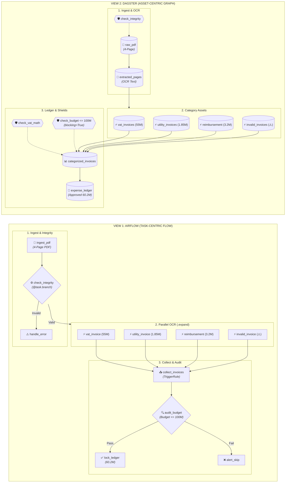

# 🎙️ KỊCH BẢN THUYẾT TRÌNH & LIVE DEMO CHI TIẾT (CUE SHEET)
## Chuyên đề: So Sánh Thực Chiến Apache Airflow vs. Dagster (On-Premise / K8s)
### Bài toán: Xử Lý File PDF Đa Hóa Đơn & Kiểm Toán Tài Chính Doanh Nghiệp

---

## ⏱️ PHÂN BỔ THỜI GIAN TỔNG THỂ (TỔNG: 35 PHÚT)

| Phần | Thời lượng | Nội dung trọng tâm | Slide tương ứng |
| :--- | :---: | :--- | :---: |
| **Phần 1: Bối cảnh AWS & 2 Ứng viên** | 4 phút | Hiện trạng AWS Step Functions (PROS/CONS) & Đặt vấn đề On-Premise/K8s | Slide 1 - 2 |
| **Phần 2: Bài toán Hóa đơn Đa trang** | 4 phút | Nghiệp vụ 4 loại hóa đơn, xử lý song song & thẩm định ngân sách 100M | Slide 3 |
| **Phần 3: Hai Triết lý & 2 Góc nhìn** | 5 phút | Task-Centric vs. Asset-Centric (Sơ đồ đối chiếu luồng thực tế) | Slide 4 |
| **Phần 4: Vòng đời Thực thi (Under the Hood)** | 6 phút | Vòng đời 1 Task Airflow vs. Vòng đời 1 Asset Dagster | Slide 5 - 6 |
| **Phần 5: Hạ tầng On-Premise & CI/CD** | 4 phút | Cụm On-Prem (MinIO, K8s) & Kiểm thử tự động in-memory 0.12s | Slide 7 |
| **Phần 6: Ma trận, Định vị & Q&A** | 12 phút | Ma trận 7 tiêu chí, Khi nào dùng ai, Lộ trình & Hỏi đáp | Slide 8 - 11 |

---

## 🎬 KỊCH BẢN THUYẾT TRÌNH CHI TIẾT TỪNG PHÚT

### 🟢 PHẦN 1: BỐI CẢNH AWS & 2 ỨNG VIÊN THAY THẾ (00:00 - 04:00)

#### Slide 1: Trang Tiêu Đề (Apache Airflow & dagster)
* **Thao tác màn hình**: Chiếu Slide 1.
* **Thời lượng**: 01:00
* **Lời thoại diễn giả**:
  > *"Xin chào anh chị và các bạn. Chào mừng mọi người đến với buổi chia sẻ chuyên đề hôm nay: **So sánh thực chiến giữa Apache Airflow và Dagster**.
  >
  > Đây là hai nền tảng điều phối dữ liệu (Data Orchestration) mã nguồn mở phổ biến nhất hiện nay. Thay vì so sánh lý thuyết trên giấy, hôm nay chúng ta sẽ xuất phát từ chính bài toán thực tế của team mình, đối chiếu từng dòng code và mổ xẻ cấu tạo hoạt động ngầm để tìm ra công cụ tối ưu nhất cho hạ tầng tương lai."*

---

#### Slide 2: Hiện Trạng AWS Step Functions (PROS & CONS) & Đưa Ra 2 Công Cụ
* **Thao tác màn hình**: Chuyển sang Slide 2, chỉ chuột vào 2 cột **PROS** và **CONS**.
* **Thời lượng**: 03:00
* **Lời thoại diễn giả**:
  > *"Trong các dự án hiện tại của team mình, chúng ta đang phụ thuộc rất nhiều vào **AWS Step Functions** và **AWS Lambda** để chạy các luồng tự động hóa.
  >
  > - **Điểm mạnh không thể phủ nhận (PROS)**:
  >   1. **Zero-Ops**: Hoàn toàn serverless, không tốn công dựng server hay lo scheduler bị sập.
  >   2. **Tự động co giãn (Auto-scaling)**: Có 1 hay 1.000 file nạp vào hệ thống vẫn tự động đáp ứng.
  >   3. **Tích hợp sâu**: Kết nối sẵn với S3, DynamoDB, SQS, IAM.
  >   4. **Trả phí theo tải (Pay-as-you-go)**: Không chạy thì không tốn tiền CPU.
  >
  > - **Tuy nhiên, 4 nỗi đau lớn mà team đang đối mặt (CONS)**:
  >   1. **Cực hình khi Test & Debug ở Local**: Muốn test luồng phải deploy lên AWS, vòng lặp phản hồi của lập trình viên rất chậm.
  >   2. **Chi phí tăng phi mã khi chạy liên tục**: Step Functions tính phí theo từng lượt State Transition. Khi quy mô dữ liệu phình to 24/7, hóa đơn cloud tăng rất chóng mặt.
  >   3. **Bảo mật & Chủ quyền dữ liệu (Data Sovereignty)**: Dữ liệu hóa đơn, tài chính của nhiều khách hàng bắt buộc phải lưu nội bộ, không được đẩy lên public cloud.
  >   4. **Vendor Lock-in**: Bị trói cứng vào ngôn ngữ JSON của Amazon States Language (ASL).
  >
  > Vì vậy, câu hỏi chiến lược đặt ra là: **Nếu công ty cần tối ưu chi phí và đưa hệ thống về On-Premise hoặc Kubernetes riêng, chúng ta sẽ chọn công cụ gì?**
  >
  > Hôm nay, chúng ta đưa 2 đại diện sáng giá nhất lên bàn cân: **Apache Airflow** (tiêu chuẩn 10 năm qua) và **Dagster** (thế hệ mới hiện đại)."*

---

### 🟣 PHẦN 2: BÀI TOÁN HÓA ĐƠN ĐA TRANG (04:00 - 08:00)

#### Slide 3: Bài Toán Tự Động Bóc Tách & Duyệt Hóa Đơn (PDF -> DATA)
* **Thao tác màn hình**: Chuyển sang Slide 3, giới thiệu nghiệp vụ 4 loại hóa đơn và sơ đồ phê duyệt tài chính.
* **Thời lượng**: 04:00
* **Điểm nhấn nghiệp vụ**:
  1. Xử lý 1 file PDF gồm 4 trang hóa đơn khác loại: VAT Invoice, Utility Invoice, Travel Expense, và Retail Receipt (không MST, cảnh báo).
  2. Bóc tách song song 4 luồng dữ liệu nghiệp vụ.
  3. Kiểm định kép: Khớp tiền hàng + thuế VAT, và trần chi phí không vượt quá 100M VND.
  4. Phê duyệt & chốt sổ nếu đạt chuẩn, dừng khẩn cấp (Hard Stop) nếu vi phạm ngân sách.
* **Lời thoại diễn giả**:
  > *"Để so sánh thực chiến hai nền tảng, chúng ta không dùng các ví dụ 'Hello World' lý thuyết, mà đưa vào chính bài toán kinh điển của doanh nghiệp: **Tự động bóc tách và kiểm toán hồ sơ hóa đơn đa trang**:
  > - Một tập tài liệu PDF gửi lên gồm 4 trang với 4 định dạng hoàn toàn khác nhau: Hóa đơn VAT, Hóa đơn điện nước, Hóa đơn công tác, và Biên lai bán lẻ không có MST cần cảnh báo.
  > - Hệ thống cần xử lý bóc tách song song 4 luồng dữ liệu, sau đó thực hiện kiểm toán kép: Kiểm tra số học (Tiền hàng + VAT = Tổng tiền) và thẩm định chính sách tài chính (Tổng ngân sách chi không được vượt quá trần 100 triệu VNĐ).
  > - Nếu đạt chuẩn, dữ liệu được phê duyệt vào sổ cái kế toán; nếu vượt ngân sách hoặc lỗi, hệ thống phải kích hoạt cơ chế dừng khẩn cấp (Hard Stop).
  > 
  > Bây giờ, hãy xem hai triết lý kiến trúc của Airflow và Dagster giải quyết bài toán này khác biệt ra sao trên Slide 4!"*

---

### 🔵 PHẦN 3: BÀI TOÁN THỰC TẾ & SƠ ĐỒ THEO 2 GÓC NHÌN (08:00 - 13:00)

#### Slide 4: Hai Triết Lý Đối Lập & Sơ Đồ 2 Góc Nhìn
* **Thao tác màn hình**: Chiếu Slide 4, đối chiếu 2 thẻ bullet point phía trên rồi chỉ vào 2 sơ đồ Mermaid bên dưới (sơ đồ hiển thị bằng tiếng Anh chuyên ngành).
* **Thời lượng**: 04:00
* **Điểm nhấn bullet points ngắn gọn**:
  - **Airflow (Task-Centric - Bên trái)**: Câu hỏi *"Tôi phải làm gì tiếp theo?"* &rarr; Tập trung vào Task &rarr; Mù dữ liệu (`Success/Fail`) &rarr; XCom DB.
  - **Dagster (Asset-Centric - Bên phải)**: Câu hỏi *"Tôi tạo ra tài sản gì?"* &rarr; Software-Defined Assets &rarr; Cây phả hệ Lineage &rarr; Khiên Asset Checks.
* **Sơ đồ so sánh 2 góc nhìn trực quan (Diagrams in English)**:

* **Lời thoại diễn giả**:
  > *"Nhìn vào sơ đồ 2 góc nhìn:
  > - **Bên trái (Airflow)**: Một chuỗi các mũi tên chỉ hành động. Ta phải tự viết các task rẽ nhánh (`@task.branch`) để điều khiển luồng, và phải cấu hình `TriggerRule` đặc biệt để tránh lỗi khi gộp nhánh song song.
  > - **Bên phải (Dagster)**: Một chuỗi các tài sản dữ liệu sinh ra từ nhau. Đi kèm mỗi tài sản là các chiếc khiên kiểm định (`Asset Checks`). Nếu dữ liệu vi phạm ngân sách 100M, chiếc khiên sẽ tự ngắt cầu dao ngay tại chỗ.
  >
  > Bây giờ, xin mời các anh chị cùng bước vào màn hình thực tế để kiểm chứng 2 thế giới này vận hành ra sao!"*

---

### 🟡 PHẦN 4: VÒNG ĐỜI THỰC THI (UNDER THE HOOD) (13:00 - 19:00)

#### Slide 5: Vòng Đời Thực Thi 1 Task Trong Airflow
* **Thao tác màn hình**: Chiếu Slide 5, chỉ vào sơ đồ vòng đời bên trái từ bước 1 đến bước 6, đối chiếu với 4 điểm nghẽn bên phải.
* **Thời lượng**: 03:00
* **Điểm nhấn 4 khối phân tích**:
  - **1. Bị ép Re-Parse liên tục (30s)**: Quét code từ đĩa liên tục &rarr; Dễ nghẽn 100% CPU khi có import nặng.
  - **2. State Machine bắn query DB dồn dập**: Mỗi lần đổi trạng thái (None &rarr; Scheduled &rarr; Queued &rarr; Running &rarr; Success) đều UPDATE vào PostgreSQL.
  - **3. Ép nạp XCom vào DB**: Task return dữ liệu nhồi thẳng vào database làm phình to DB.
  - **4. Kết thúc bằng "Mù dữ liệu"**: Webserver chỉ đổi màu ô vuông xanh/đỏ, hoàn toàn mù về số liệu bên trong.
* **Lời thoại diễn giả**:
  > *"Kính thưa các anh chị, đây là toàn bộ vòng đời thực thi của 1 task trong Airflow:
  > 1. Khi ta nạp file code, Scheduler phải chạy vòng lặp DAG Parsing Loop mỗi 30 giây để đọc lại code từ đĩa, gây nghẽn CPU nếu có import nặng.
  > 2. Quá trình đổi trạng thái từ Scheduled sang Queued rồi Running phải liên tục bắn câu lệnh UPDATE vào PostgreSQL.
  > 3. Khi task muốn truyền dữ liệu cho task sau, dữ liệu bị nhồi thẳng vào bảng xcom của database, làm phình to DB.
  > 4. Cuối cùng, Webserver chỉ đọc DB để tô màu ô vuông Xanh/Đỏ mà hoàn toàn mù về dữ liệu nghiệp vụ bên trong!"*

---

#### Slide 6: Vòng Đời Khởi Tạo 1 Asset Trong Dagster
* **Thao tác màn hình**: Chuyển sang Slide 6, chỉ vào dòng chảy khởi tạo Asset của Dagster từ gRPC đến S3 và Asset Checks.
* **Thời lượng**: 03:00
* **Điểm nhấn 4 ưu thế kiến trúc**:
  - **1. Khám phá Metadata qua gRPC**: Code chạy trong container riêng, Scheduler không nạp code nặng.
  - **2. Chạy trong Ephemeral Worker**: Pod độc lập chạy tính toán, code lỗi không làm sập server, reload tức thì.
  - **3. I/O Manager độc lập**: Dữ liệu lưu thẳng ra S3/MinIO/Snowflake, DB hệ thống chỉ lưu event log.
  - **4. Khiên Asset Checks gác cổng**: Thẩm định ngân sách 100M ngay trong chu trình, ngắt cầu dao tại chỗ và hiển thị live lên UI.
* **Lời thoại diễn giả**:
  > *"Bây giờ, hãy nhìn sang toàn bộ vòng đời khởi tạo 1 tài sản trong Dagster:
  > 1. Toàn bộ code xử lý dữ liệu được cô lập trong User Code Server, nói chuyện với nền tảng qua gRPC. Scheduler không cần nạp code nặng.
  > 2. Mỗi lần chạy, Dagster bật một Worker Pod độc lập để tính toán. Code có crash cũng không ảnh hưởng hệ thống.
  > 3. Dữ liệu tính toán xong được I/O Manager đẩy thẳng lên S3 hoặc Snowflake, database chỉ lưu nhật ký sự kiện Event Log cực nhẹ.
  > 4. Ngay trong chu trình chạy, chiếc khiên Asset Checks tự động thẩm định dữ liệu. Nếu vượt ngân sách 100 triệu, nó ngắt luồng tại chỗ và báo đỏ trực tiếp trên giao diện cho cả team cùng thấy!"*

---

### 🟠 PHẦN 5: HẠ TẦNG ON-PREMISE & NĂNG LỰC CI/CD (19:00 - 23:00)

#### Slide 7: Hạ Tầng On-Premise & Định Vị Nền Tảng (4 Trụ Cột Chiến Lược)
* **Thao tác màn hình**:
  1. Chiếu Slide 7 (gồm 4 khối nội dung cân đối).
  2. Nửa trên: Chỉ vào so sánh hạ tầng On-Premise (Airflow 6 thành phần + NFS vs Dagster K8s + MinIO S3) và năng lực kiểm thử TDD in-memory 0.12s với lệnh `pytest`.
  3. Nửa dưới: Chỉ vào tiêu chí lựa chọn thực tế "Khi nào nên chọn Airflow" và "Khi nào nên chọn Dagster (Đề xuất số 1)".
* **Thời lượng**: 04:00
* **Điểm nhấn 4 trụ cột**:
  - **1. Hạ tầng On-Premise**: Airflow cồng kềnh, nghẽn đĩa chia sẻ NFS; Dagster chuẩn Cloud-Native K8s, MinIO S3, cô lập Pods qua gRPC.
  - **2. Kiểm thử CI/CD & DevX**: Airflow dính chặt DB; Dagster test in-memory 0.12 giây, tích hợp PR hook tự động.
  - **3. Khi nào chọn Airflow**: Điều phối hạ tầng chung, chạy job Spark/batch độc lập, doanh nghiệp đã có cụm máy chủ và đội Ops cũ.
  - **4. Khi nào chọn Dagster**: Thay thế AWS Step Functions, xử lý hóa đơn tài chính phức tạp, kiểm soát chất lượng bằng Asset Checks.
* **Lời thoại diễn giả**:
  > *"Thưa các anh chị, slide này tổng hợp trọn vẹn 4 trụ cột chiến lược khi chuyển dịch hệ thống:
  > 1. Về hạ tầng: Dagster tối giản chỉ 3 service cốt lõi trên Kubernetes, lưu MinIO S3, loại bỏ hoàn toàn rủi ro nghẽn ổ đĩa NFS của Airflow.
  > 2. Về kiểm thử CI/CD: Thay vì mất vài phút dựng DB như Airflow, Dagster test in-memory bằng pytest chỉ mất 0.12 giây trên từng Pull Request.
  > 3. Về định vị: Airflow vẫn phù hợp nếu công ty chỉ cần bật/tắt VM hay chạy job batch thô. Nhưng để thay thế State Machine của AWS Step Functions, xử lý hồ sơ tài chính và làm chủ Data Platform On-Premise, Dagster chính là sự lựa chọn số 1 của chúng ta!"*

---

### 🟣 PHẦN 6: MA TRẬN ĐÁNH GIÁ, ĐỊNH VỊ & LỘ TRÌNH (23:00 - 29:00)

#### Slide 8: Ma Trận So Sánh Kỹ Thuật Tổng Hợp (7 Tiêu Chí)
* **Thao tác màn hình**: Chiếu Slide 8, lướt nhanh qua bảng 7 tiêu chí chấm điểm kỹ thuật.
* **Thời lượng**: 02:00
* **Lời thoại diễn giả**:
  > *"Bảng ma trận 7 tiêu chí đã tổng kết toàn diện: Ngoại trừ lợi thế tuổi đời lâu năm và hệ sinh thái cũ của Airflow, Dagster vượt trội hoàn toàn về kiểm thử tự động, quản lý dữ liệu, Data Lineage, và độ ổn định trên Kubernetes."*

---

#### Slide 9: Khi Nào Dùng Ai? (Định Vị Doanh Nghiệp)
* **Thao tác màn hình**: Chiếu Slide 9, chỉ vào cây quyết định lựa chọn công nghệ.
* **Thời lượng**: 02:00
* **Lời thoại diễn giả**:
  > *"Vậy doanh nghiệp nên chọn công cụ nào?
  > - Nếu chỉ cần một công cụ Cronjob kích hoạt dbt hay trigger job ngoài: Airflow vẫn dùng được.
  > - Nhưng với bài toán thay thế AWS Step Functions: Bóc tách hóa đơn, phân loại nghiệp vụ tài chính phức tạp, đòi hỏi kiểm thử CI/CD và Data Platform On-Premise: **Dagster là sự lựa chọn vượt trội tối ưu**."*

---

#### Slide 10: Lộ Trình Triển Khai 3 Giai Đoạn (Migration Roadmap)
* **Thao tác màn hình**: Chiếu Slide 10, trình bày kế hoạch di chuyển an toàn.
* **Thời lượng**: 01:30
* **Lời thoại diễn giả**:
  > *"Chúng tôi đề xuất lộ trình 3 giai đoạn: Giai đoạn 1 chạy song song (Shadow Run) với 1 pipeline hóa đơn để đối chiếu; Giai đoạn 2 mở rộng toàn bộ nghiệp vụ tài chính; Giai đoạn 3 chuẩn hóa Dagster thành nền tảng Orchestrator chung cho toàn công ty."*

---

#### Slide 11: Tổng Kết & Giải Đáp Phản Biện (Q&A)
* **Thao tác màn hình**: Chiếu Slide 11, mở repository mã nguồn demo.
* **Thời lượng**: 01:30 (và bắt đầu phần hỏi đáp)
* **Lời thoại diễn giả**:
  > *"Toàn bộ mã nguồn demo, DAG Airflow, Assets Dagster và bộ Unit Test tự động đã sẵn sàng trong repository nội bộ. Xin chân thành cảm ơn ban lãnh đạo và các đồng nghiệp đã chú ý theo dõi. Bây giờ xin mời các anh chị đặt câu hỏi!"*

---

## 🛡️ BỘ CÂU HỎI PHÒNG THỦ DỰ KIẾN (TOUGH QUESTIONS & ANSWERS)

#### Q1: "Airflow là tiêu chuẩn ngành 10 năm nay, chuyển sang Dagster có khó tuyển dụng kỹ sư không?"
> **Trả lời:** *"Airflow dễ tuyển hơn vì tuổi đời lâu năm. Tuy nhiên, rào cản của Dagster chủ yếu là việc chuyển dịch tư duy từ Task sang Asset (mất khoảng 1-2 tuần). Ngược lại, code của Dagster là Python thuần túy, tuân thủ chặt chẽ chuẩn mực Software Engineering (type hints, dependency injection, unit test) nên các kỹ sư Backend, Data Engineer hay Python dev tiếp cận cực kỳ nhanh và ít sinh lỗi hơn nhiều so với viết DAG Airflow."*

#### Q2: "Nếu dùng Dagster trên On-Premise thì cần những thành phần hạ tầng nào?"
> **Trả lời:** *"Kiến trúc rất tinh gọn: Cụm Kubernetes nội bộ, 1 cơ sở dữ liệu PostgreSQL HA lưu metadata trạng thái, và 1 cụm MinIO phân tán đóng vai trò S3 Object Storage để I/O Manager lưu trữ dữ liệu trung gian. Dagster cung cấp Official Helm Chart chuẩn production đã được cộng đồng kiểm chứng."*

#### Q3: "Airflow 2.x/3.x cũng có Datasets và TaskFlow API rồi, sao không dùng Airflow tiếp?"
> **Trả lời:** *"Airflow có bổ sung Datasets nhưng chỉ là 'lớp vỏ bên ngoài' (cơ chế trigger dựa trên data update), bên dưới lõi thực thi vẫn là chuỗi Task-centric phụ thuộc vào DAG parsing loop và XCom qua Database. Dagster được thiết kế từ tận gốc rễ như một Graph Data Engine, hỗ trợ first-class Asset Checks, I/O Manager cắm rút và kiểm thử in-process trong RAM mà Airflow không thể có được do gánh nặng kiến trúc di sản."*
