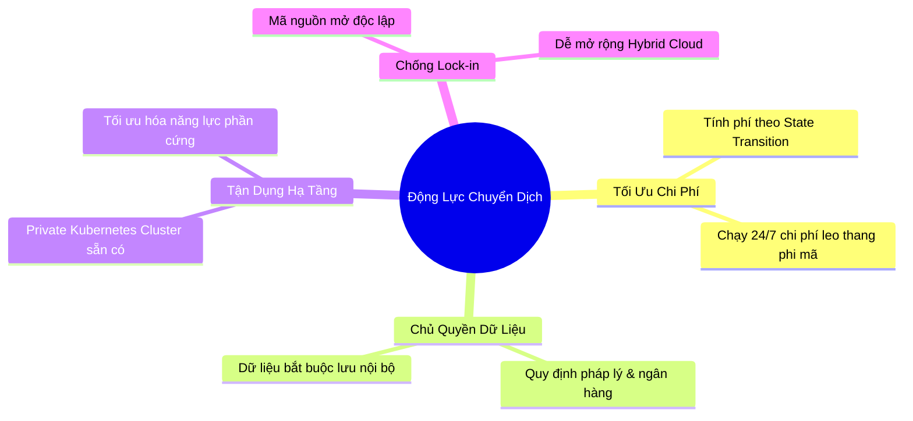
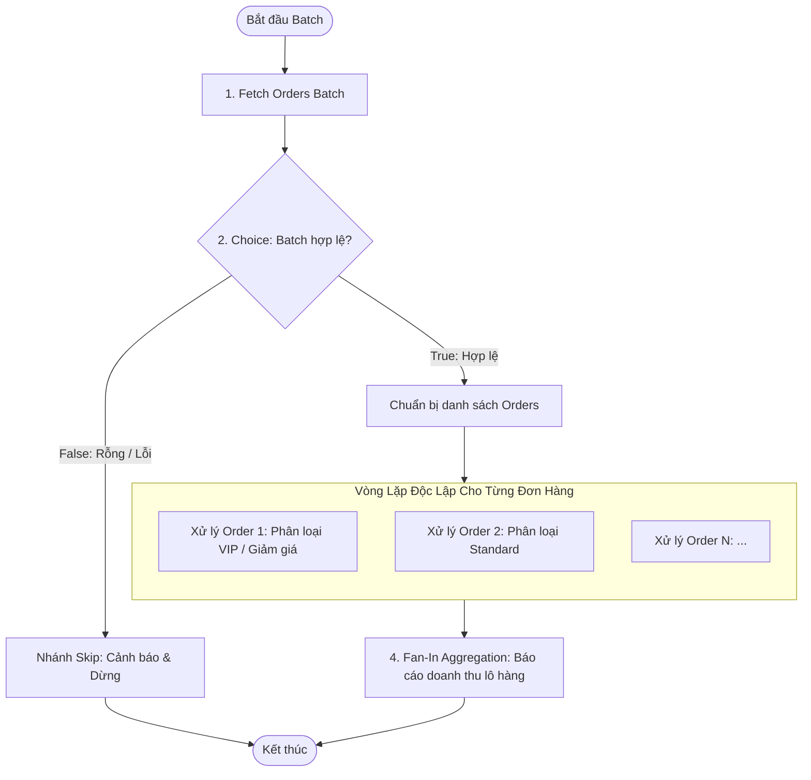
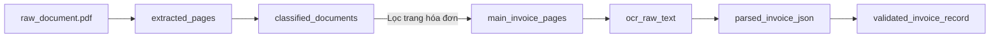
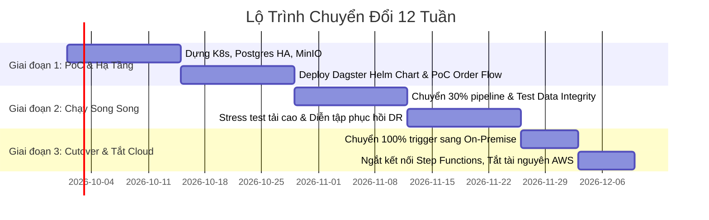

# BỘ SLIDE THUYẾT TRÌNH: CHUYỂN DỊCH WORKFLOW ORCHESTRATION TỪ AWS STEP FUNCTIONS SANG ON-PREMISE (AIRFLOW VS. DAGSTER)

> **Chủ đề:** Hành trình On-Premise Orchestration: Chuyển dịch từ AWS Step Functions sang Apache Airflow hay Dagster?  
> **Thời lượng:** 35 - 45 phút (bao gồm Demo & Q&A)  
> **Người trình bày:** Tech Lead / Senior Data Engineer  
> **Đối tượng:** CTO, Engineering Manager, Tech Lead, Data & DevOps Engineers  

---

## MỤC LỤC BÀI THUYẾT TRÌNH

1. **PHẦN 1: MỞ ĐẦU & BỐI CẢNH CHUYỂN DỊCH** (Slide 1 - 5)
   - Hiện trạng AWS Step Functions
   - 4 Động lực chính chuyển dịch về On-Premise
   - Thách thức khi rời bỏ Serverless
   - Đặt vấn đề: Airflow hay Dagster?
2. **PHẦN 2: KHÁI NIỆM CỐT LÕI CỦA AIRFLOW VÀ DAGSTER** (Slide 6 - 10)
   - Hai triết lý đối lập: Task-Centric vs. Data/Asset-Centric
   - Bảng ánh xạ Mental Model từ Step Functions sang Airflow & Dagster
   - Cơ chế luân chuyển dữ liệu: XCom vs. IOManager
   - Kiến trúc On-Premise & Mức độ cách ly hệ thống
   - Developer Experience & Khả năng kiểm thử (Testing)
3. **PHẦN 3: DEMO & PHÂN TÍCH CHUYÊN SÂU TRONG CODE** (Slide 11 - 17)
   - Kịch bản nghiệp vụ: Order Processing Workflow
   - Phân tích Code Airflow (`order_processing_dag.py`)
   - Phân tích Code Dagster Ops & Jobs (`ops_workflow.py`)
   - Phân tích Code Dagster Software-Defined Assets (`assets_workflow.py`)
   - Phân tích Code Unit Test với Pytest (`test_order_processing.py`)
   - Mở rộng thực tế: Bài toán Ingest & Xử lý OCR nhiều bước
4. **PHẦN 4: MA TRẬN QUYẾT ĐỊNH & LỘ TRÌNH TRIỂN KHAI** (Slide 18 - 20)
   - Ma trận đánh giá chấm điểm có trọng số
   - Khuyến nghị quyết định
   - Lộ trình di chuyển 3 giai đoạn (Safe Migration Roadmap)
   - Q&A & Action Items

---

<!-- SLIDE 1 -->
# SLIDE 1: Trang Tiêu Đề

### **HÀNH TRÌNH ON-PREMISE ORCHESTRATION**
#### *Chuyển dịch từ AWS Step Functions sang Apache Airflow hay Dagster?*

* **Diễn giả:** [Tên của bạn] - Tech Lead / Data Platform Team
* **Mục tiêu:** Đánh giá kỹ thuật, phân tích code demo thực tế, lựa chọn giải pháp điều phối luồng dữ liệu tối ưu cho hạ tầng On-Premise.

---
**🎙️ Lời thoại diễn giả (Speaker Notes):**
> "Kính chào các anh chị em và ban lãnh đạo. Hôm nay, chúng ta cùng bàn về một chủ đề mang tính bước ngoặt trong kiến trúc dữ liệu và tự động hóa của doanh nghiệp: Làm thế nào để chuyển dịch các quy trình nghiệp vụ phức tạp đang chạy trên AWS Step Functions về vận hành hiệu quả, tối ưu chi phí trên hạ tầng On-Premise. Chúng ta sẽ đặt lên bàn cân hai ứng cử viên sáng giá nhất hiện nay: Apache Airflow - vị vua truyền thống của ngành điều phối dữ liệu, và Dagster - đại diện thế hệ mới với triết lý quản lý tài sản dữ liệu hiện đại."

---

<!-- SLIDE 2 -->
# SLIDE 2: Hiện Trạng - Vì Sao Từng Chọn AWS Step Functions?

### **Serverless State Machine trên AWS Cloud**

* **Mô hình kiến trúc:** 
  * Định nghĩa trạng thái bằng JSON (Amazon States Language - ASL).
  * Điều phối trực tiếp các dịch vụ Serverless: AWS Lambda, ECS Fargate, AWS Glue, Athena, SNS/SQS.
* **Các ưu điểm đã tận dụng:**
  * ✅ **Zero Infra Overhead:** Không tốn nhân sự bảo trì máy chủ, database, scheduler hay worker.
  * ✅ **Trực quan hóa tuyệt vời:** Visual Workflow Studio, theo dõi visual state machine theo thời gian thực.
  * ✅ **Tích hợp sâu hệ sinh thái AWS:** Bảo mật bằng IAM role, trigger bằng EventBridge.

---
**🎙️ Lời thoại diễn giả (Speaker Notes):**
> "Trong giai đoạn đầu khởi tạo dự án trên đám mây, Step Functions là lựa chọn hoàn hảo. Chúng ta chỉ cần viết các file JSON trạng thái, ghép nối Lambda và ECS mà không cần bận tâm đến việc cài đặt server hay quản lý hàng đợi. Tuy nhiên, khi hệ thống bước sang giai đoạn phát triển ổn định với tần suất chạy liên tục và khối lượng dữ liệu khổng lồ, những điểm hạn chế bắt đầu bộc lộ."

---

<!-- SLIDE 3 -->
# SLIDE 3: 4 Động Lực Chuyển Dịch Về On-Premise



* **1. Chi phí (Cost Optimization):** Step Functions tính tiền theo từng lượt chuyển trạng thái (State Transition). Với pipeline xử lý hàng triệu transaction hoặc OCR ảnh, chi phí Cloud tăng vọt.
* **2. Bảo mật & Chủ quyền dữ liệu (Compliance & Sovereignty):** Yêu cầu lưu trữ và xử lý thông tin khách hàng tuyệt mật bên trong Datacenter On-premise.
* **3. Tận dụng hạ tầng sẵn có:** Hạ tầng Kubernetes nội bộ và hệ thống lưu trữ đã được đầu tư cần được tối đa hóa hiệu suất.
* **4. Chống Vendor Lock-in:** Code ASL JSON không thể đem sang môi trường khác; cần chuẩn hóa về mã nguồn mở bằng Python.

---
**🎙️ Lời thoại diễn giả (Speaker Notes):**
> "Động lực chuyển dịch của chúng ta đến từ 4 trụ cột: Một là tối ưu chi phí vận hành định kỳ khi quy mô tăng cao; Hai là đáp ứng tuyệt đối các tiêu chuẩn bảo mật dữ liệu nhạy cảm; Ba là tận dụng cụm hạ tầng phần cứng nội bộ đã đầu tư; và Bốn là thoát khỏi sự ràng buộc độc quyền của Cloud Provider."

---

<!-- SLIDE 4 -->
# SLIDE 4: Thách Thức Khi Rời Bỏ Serverless

### **Từ "Dịch vụ có sẵn" sang "Tự mình làm chủ"**

| Yếu Tố | AWS Step Functions (Cũ) | On-Premise Tự Quản Trị (Mới) |
| :--- | :--- | :--- |
| **Quản trị Hạ tầng** | AWS lo toàn bộ (Zero Infra) | Phải tự dựng Scheduler, Queue, Metadata DB, UI |
| **State & Data Passing** | AWS Engine quản lý payload JSON | Phải tự thiết kế giải pháp lưu trữ trung gian (MinIO / S3 API) |
| **Ngôn ngữ định nghĩa** | JSON tĩnh (ASL) | Code-as-Configuration hoàn toàn bằng **Python** |
| **Độ sẵn sàng (HA)** | Tự động Scale & Multi-AZ | Phải thiết lập K8s Deployments, StatefulSets, DB HA |
| **Local Testing** | ❌ Cực kỳ khó, phải mock hoặc deploy lên AWS | 🎯 **Yêu cầu bắt buộc: Phải chạy test local mượt mà!** |

> ⚠️ *Nỗi đau lớn nhất khi còn ở Step Functions:* Đội ngũ dev mất quá nhiều thời gian để debug một lỗi logic nhỏ vì không thể chạy thử pipeline hoàn chỉnh ngay trên máy cá nhân.

---
**🎙️ Lời thoại diễn giả (Speaker Notes):**
> "Rời bỏ Step Functions mang lại sự tự do và tiết kiệm, nhưng đặt lên vai chúng ta thách thức về năng lực tự vận hành. Đặc biệt, chúng ta phải giải quyết triệt để nỗi đau lớn nhất của Step Functions trước đây: việc lập trình và kiểm thử cục bộ cực kỳ khó khăn. Vì vậy, công cụ mới được chọn phải có trải nghiệm lập trình vượt trội."

---

<!-- SLIDE 5 -->
# SLIDE 5: Đặt Vấn Đề: Apache Airflow hay Dagster?

### **Hai Ứng Cử Viên Sáng Giá Nhất Hiện Nay**

* **ỨNG CỬ VIÊN 1: APACHE AIRFLOW**
  * *Biệt danh:* "Vị vua tiền nhiệm" (The Industry Standard).
  * *Lịch sử:* Ra đời năm 2014 tại Airbnb, tốt nghiệp Apache Top-level project.
  * *Thế mạnh:* Cộng đồng cực lớn, thư viện plugin/provider khổng lồ kết nối mọi hệ thống.
* **ỨNG CỬ VIÊN 2: DAGSTER**
  * *Biệt danh:* "Thế hệ kế cận" (Next-Generation Orchestrator).
  * *Lịch sử:* Ra đời năm 2018 (sáng lập bởi Nick Schrock - cựu tác giả GraphQL tại Facebook).
  * *Thế mạnh:* Thiết kế chuẩn Software Engineering, hỗ trợ Unit Test đỉnh cao, tích hợp sẵn Data Lineage & Asset Catalog.

---
**🎙️ Lời thoại diễn giả (Speaker Notes):**
> "Đứng trước bài toán này, chúng ta có hai hướng đi tiêu biểu: Chọn Airflow - con đường quen thuộc, an toàn về mặt tuyển dụng và thị trường; hoặc chọn Dagster - một kiến trúc hiện đại hơn, giải quyết triệt để các vấn đề cốt lõi về chất lượng dữ liệu và kiểm thử phần mềm. Hãy cùng đi sâu vào so sánh khái niệm của hai công cụ này."

---

<!-- SLIDE 6 -->
# SLIDE 6: Triết Lý Thiết Kế Đối Lập

### **Task-Centric (Airflow) vs. Data/Asset-Centric (Dagster)**

```
┌────────────────────────────────────────────────────────────────────────┐
│ APACHE AIRFLOW: TASK-CENTRIC MENTALITY                                 │
│ "Làm việc gì, và làm theo thứ tự nào?"                                 │
│                                                                        │
│   [Task A: Fetch API] ──>> [Task B: Clean Data] ──>> [Task C: Save DB] │
│   * Trọng tâm: Chuỗi hành động thực thi (Execution DAG).               │
│   * Dữ liệu sinh ra chỉ là "tác dụng phụ" (side-effect) không theo dõi.│
└────────────────────────────────────────────────────────────────────────┘

┌────────────────────────────────────────────────────────────────────────┐
│ DAGSTER: DATA/ASSET-CENTRIC MENTALITY                                  │
│ "Dữ liệu nào cần sinh ra, và dữ liệu đó phụ thuộc vào đâu?"           │
│                                                                        │
│   (Asset: raw_orders) ──>> (Asset: clean_orders) ──>> (Asset: revenue) │
│   * Trọng tâm: Vòng đời và trạng thái của Tài sản Dữ liệu.            │
│   * Tự động hiểu Data Lineage, Data Freshness, và cho phép Re-materialize│
└────────────────────────────────────────────────────────────────────────┘
```

---
**🎙️ Lời thoại diễn giả (Speaker Notes):**
> "Đây là slide quan trọng nhất về mặt tư duy. Airflow sinh ra trong thời kỳ quản lý tác vụ: nó chỉ quan tâm Task A chạy xong thì kích hoạt Task B. Nó không biết bên trong Task A có sinh ra file gì hay không. Ngược lại, Dagster định nghĩa hệ thống dựa trên Tài sản dữ liệu (Software-Defined Assets). Chúng ta khai báo bảng dữ liệu nào cần được sinh ra, và Dagster sẽ tự động tính toán đồ thị phụ thuộc để chạy các bước tương ứng."

---

<!-- SLIDE 7 -->
# SLIDE 7: Mental Model Mapping từ Step Functions

### **Bảng Ánh Xạ Khái Niệm Tương Đương 1-1**

| Khái niệm AWS Step Functions | Tương đương trong Apache Airflow | Tương đương trong Dagster |
| :--- | :--- | :--- |
| **State Machine Definition** | `@dag` / Python DAG file | `@job` (Ops workflow) hoặc `Definitions` (Asset Graph) |
| **Task State** (Lambda, ECS) | Operator / `@task` (TaskFlow API) | `@op` (Ops) hoặc `@asset` (SDA) |
| **Choice State** (If-Else) | `@task.branch` (`BranchPythonOperator`) | Multi-Out `@op` (`yield Output(name=...)`) |
| **Map State** (Dynamic Loop) | Dynamic Task Mapping (`.expand()`) | Dynamic Outputs (`DynamicOut`) / Partitioned Assets |
| **Payload Input/Output JSON**| Airflow XCom (Metadata DB) | `IOManager` (Type-safe, tự động ghi S3/MinIO/Disk) |
| **State History & Logs** | Grid View & Task Logs | Run Timeline, Step Events, Asset Materialization |

---
**🎙️ Lời thoại diễn giả (Speaker Notes):**
> "Khi chuyển đổi từ Step Functions, các kỹ sư không cần phải học lại từ đầu vì mọi khái niệm trong Step Functions đều có ánh xạ tương đương trong cả Airflow và Dagster. Điểm khác biệt mấu chốt nằm ở cách xử lý dữ liệu truyền giữa các bước, như chúng ta sẽ thấy ở slide tiếp theo."

---

<!-- SLIDE 8 -->
# SLIDE 8: Luân Chuyển Dữ Liệu: XCom vs. IOManager

### **Bản Chất Của Việc Truyền Data Giữa Các Bước**

* **Airflow XCom (Cross-Communication):**
  * Lưu trữ trực tiếp trong cơ sở dữ liệu Metadata (Postgres).
  * ❌ Giới hạn kích thước nghiêm ngặt (mặc định vài chục KB - 1MB).
  * Nếu muốn truyền danh sách đơn hàng lớn hoặc hình ảnh, developer phải tự code logic upload lên S3/MinIO và chỉ truyền link URL qua XCom.
* **Dagster IOManager (Cuộc cách mạng):**
  * Tách biệt hoàn toàn code xử lý nghiệp vụ với cơ chế lưu trữ.
  * ✅ Hàm chỉ cần `return orders_list`. IOManager sẽ tự động serialize (pickle, parquet, json) đẩy vào MinIO/Disk.
  * Task tiếp theo chỉ cần khai báo biến đầu vào là tự động nhận đúng data đã deserialize.
  * Cho phép hoán đổi storage giữa Local Disk (khi dev) và MinIO (khi lên Production) chỉ bằng 1 dòng config!

---
**🎙️ Lời thoại diễn giả (Speaker Notes):**
> "Dưới nắp ca-pô, tại sao Airflow lại thiết kế XCom như vậy? Vào năm 2014, Airflow sinh ra để điều phối các job Spark/Hadoop khổng lồ. Dữ liệu cần truyền giữa các task khi đó chỉ là vài chục bytes chuỗi đường dẫn HDFS hoặc Job ID, do đó Airflow thực hiện câu lệnh SQL INSERT thẳng vào bảng `xcom` trong PostgreSQL. Nhưng ngày nay, khi kỹ sư xử lý Pandas DataFrame, mảng JSON lớn hay ảnh OCR, việc nhồi hàng trăm MB vào Postgres sẽ làm sập Scheduler! Ngược lại, Dagster sinh ra năm 2018 với triết lý IOManager: Tách rời hoàn toàn Logic tính toán và Hạ tầng lưu trữ. Hàm của bạn là Python thuần, còn IOManager tự lo việc ghi Parquet/Pickle ra MinIO và nạp lại ở bước sau. Cơ sở dữ liệu Postgres của Dagster không bao giờ bị phình to."

---

<!-- SLIDE 9 -->
# SLIDE 9: Kiến Trúc Vận Hành On-Premise & Sự Cách Ly

```
                 KIẾN TRÚC TRIỂN KHAI ON-PREMISE (KUBERNETES)

  APACHE AIRFLOW ARCHITECTURE                DAGSTER ARCHITECTURE
 ┌───────────────────────────┐             ┌───────────────────────────┐
 │ Webserver + Scheduler     │             │ Dagster Webserver + Daemon│ (Control Plane)
 └─────────────┬─────────────┘             └─────────────┬─────────────┘
               │ (Polling parse file *.py)               │ gRPC (Cách ly hoàn toàn)
 ┌─────────────▼─────────────┐             ┌─────────────▼─────────────┐
 │ Celery / Redis Broker     │             │ Code Location Containers  │ (User Code Team A)
 └─────────────┬─────────────┘             ├───────────────────────────┤
               │                           │ Code Location Containers  │ (User Code Team B)
 ┌─────────────▼─────────────┐             └─────────────┬─────────────┘
 │ Airflow Workers (Tập trung│                           │ K8s Run Launcher
 │ chung môi trường Python)  │             ┌─────────────▼─────────────┐
 └───────────────────────────┘             │ Dynamic Ephemeral K8s Pods│
```

* **Airflow (Vòng lặp DAG Parsing Loop):** Scheduler liên tục quét và thực thi lại top-level code của toàn bộ file DAG mỗi 30 giây. Code của kỹ sư chạy chung process với worker. Xung đột thư viện và bẫy nghẽn DB do top-level code là rủi ro thường trực.
* **Dagster (Phân tách Code Location qua gRPC):** Daemon không bao giờ parse code developer. Code được nạp một lần duy nhất trong container gRPC riêng của từng team. Lỗi cú pháp hay crash OOM ở pipeline A hoàn toàn không ảnh hưởng đến pipeline B hay Control Plane chung.

---
**🎙️ Lời thoại diễn giả (Speaker Notes):**
> "Về mặt vận hành On-premise, điểm khác biệt lớn nhất bên dưới nắp ca-pô là cơ chế nạp code: Airflow dùng vòng lặp liên tục quét thư mục dags mỗi 30 giây, khiến Scheduler luôn tốn nhiều CPU và rất nguy hiểm nếu ai lỡ viết kết nối DB ở ngoài hàm. Trong khi đó, Dagster dùng kiến trúc Microservices phân tách: Lõi điều phối (Daemon) và code của kỹ sư giao tiếp qua gRPC. Mỗi team sở hữu một Code Location container riêng, dùng phiên bản Python và thư viện độc lập mà không sợ xung đột."

---

<!-- SLIDE 10 -->
# SLIDE 10: Developer Experience & Khả Năng Kiểm Thử (DevX)

### **Thước Đo Sự Hài Lòng Của Đội Ngũ Kỹ Sư**

| Tiêu Chí Đánh Giá | Apache Airflow | Dagster (Ưu thế tuyệt đối) |
| :--- | :--- | :--- |
| **Chạy thử nghiệm trên máy Local** | Nặng nề; thường cần dựng cụm Docker Compose (DB + Webserver + Scheduler) | Nhẹ nhàng; chỉ cần lệnh `dagster dev` chạy ngay lập tức |
| **Viết Unit Test bằng Pytest** | Phức tạp; cần mock Airflow Context, TaskInstance, Jinja templating | **Cực kỳ tự nhiên;** các op và asset bản chất là hàm Python thuần |
| **Kiểm thử Pipeline In-Memory** | Khó thực hiện offline hoàn toàn | Hỗ trợ hàm `job.execute_in_process()` và `materialize()` chạy trong RAM |
| **Thời gian phản hồi (Feedback loop)**| Vài phút cho mỗi lần sửa lỗi | **Vài giây** ngay trên IDE |

---
**🎙️ Lời thoại diễn giả (Speaker Notes):**
> "Đây là yếu tố quyết định năng suất của kỹ sư. Với Dagster, chúng ta có thể áp dụng toàn bộ chuẩn mực phát triển phần mềm hiện đại: viết unit test với pytest, chạy CI/CD tự động trước khi merge code. Với Airflow, việc kiểm thử cục bộ luôn là một trải nghiệm cồng kềnh."

---

<!-- SLIDE 11 -->
# SLIDE 11: Kịch Bản Nghiệp Vụ Demo Thực Tế

### **Order Processing Pipeline (Mô phỏng quy trình Step Functions)**



* **Yêu cầu kỹ thuật cần giải quyết:**
  1. Xử lý logic rẽ nhánh If-Else có điều kiện (Choice State).
  2. Xử lý vòng lặp song song động số lượng phần tử không cố định (Dynamic Map State).
  3. Gom kết quả (Fan-in) mà không bị lỗi khi một nhánh bị skip.

---
**🎙️ Lời thoại diễn giả (Speaker Notes):**
> "Để chứng minh năng lực thực tế của hai công cụ, chúng tôi đã xây dựng một kịch bản demo tiêu biểu: Xử lý lô đơn hàng. Pipeline này có đầy đủ các bài toán kinh điển: Đọc batch, rẽ nhánh điều kiện Choice State, phân rã lặp song song Map State và tổng hợp kết quả cuối cùng. Hãy cùng xem code triển khai thực tế trên cả Airflow và Dagster."

---

<!-- SLIDE 12 -->
# SLIDE 12: Phân Tích Code Airflow (`order_processing_dag.py`)

```python
# 1. TaskFlow API & Choice State với @task.branch
@task.branch
def check_batch_condition(batch_info: Dict[str, Any]) -> str:
    if batch_info.get("is_active") and len(batch_info.get("orders", [])) > 0:
        return "prepare_orders_for_mapping"  # Tên task đích
    return "handle_skipped_batch"

# 2. Dynamic Task Mapping tương đương Map State
@task
def process_single_order(order: Dict[str, Any]) -> Dict[str, Any]:
    discount = order["amount"] * 0.10 if order["amount"] >= 1000 else 0.0
    return {**order, "final_price": order["amount"] - discount}

# 3. Fan-in Aggregation bắt buộc phải chỉnh Trigger Rule
@task(trigger_rule=TriggerRule.NONE_FAILED_MIN_ONE_SUCCESS)
def aggregate_results(processed_orders: List[Dict[str, Any]]):
    return {"total_revenue": sum(o["final_price"] for o in processed_orders)}

# Thiết lập luồng
orders_list = prepare_orders_for_mapping(batch_data)
mapped_orders = process_single_order.expand(order=orders_list) # .expand() tạo loop
summary = aggregate_results(mapped_orders)
```

* **Nhận xét chuyên môn:**
  * Cú pháp Airflow 3 TaskFlow API đã gọn hơn rất nhiều so với Airflow 1/2 cổ điển.
  * Tính năng `.expand()` xử lý Dynamic Mapping tương đối tốt.
  * ⚠️ Nhược điểm: Bắt buộc phải cấu hình `TriggerRule` thủ công ở các task hội tụ, nếu không toàn bộ nhánh sau sẽ bị đánh dấu `SKIPPED`. Dữ liệu ngầm truyền qua XCom table.

---
**🎙️ Lời thoại diễn giả (Speaker Notes):**
> "Đây là mã nguồn Airflow viết bằng TaskFlow API hiện đại. Điểm đáng lưu ý là hàm branch trả về chuỗi string là tên của task tiếp theo. Khi hội tụ sau vòng lặp, chúng ta bắt buộc phải nhớ thêm tham số TriggerRule nếu không Airflow sẽ mặc định coi là upstream failed hoặc skipped."

---

<!-- SLIDE 13 -->
# SLIDE 13: Phân Tích Code Dagster Ops & Jobs (`ops_workflow.py`)

```python
# 1. Choice State mô phỏng 1-1 bằng Multi-Output có điều kiện
@op(out={"process_branch": Out(list, is_required=False), "skip_branch": Out(str, is_required=False)})
def check_batch_condition(orders: list, is_active: bool):
    if is_active and len(orders) > 0:
        yield Output(orders, output_name="process_branch")
    else:
        yield Output("Batch is empty", output_name="skip_branch")

# 2. Dynamic Map State với DynamicOut
@op(out=DynamicOut())
def fan_out_orders(orders: List[Dict[str, Any]]):
    for order in orders:
        yield DynamicOutput(order, mapping_key=order["order_id"].replace("-", "_"))

# 3. Kết nối luồng hoàn toàn Type-safe & Fan-in bằng .collect()
@job
def order_processing_job():
    orders, is_active = fetch_orders_batch()
    process_br, skip_br = check_batch_condition(orders, is_active)
    
    # Map loop song song và Gom kết quả cực kỳ tường minh
    single_orders = fan_out_orders(process_br)
    processed = single_orders.map(process_single_order)
    aggregate_results(processed.collect()) # .collect() tự gom mảng kết quả
```

* **Nhận xét chuyên môn:**
  * Dữ liệu luân chuyển tường minh như một hàm Python thông thường (Data Flow rõ ràng).
  * Hàm `.collect()` gom kết quả song song một cách tự nhiên mà không cần trick trigger_rule.
  * Toàn bộ dữ liệu được quản lý qua `IOManager`.

---
**🎙️ Lời thoại diễn giả (Speaker Notes):**
> "Với hướng tiếp cận Ops của Dagster, chúng ta thấy luồng dữ liệu hiển hiện rõ ràng: output của op này là input của op kia. Hàm fan_out_orders phân tách từng item và gọi .map(), sau đó .collect() gom tất cả lại. Code rất tường minh và có kiểu dữ liệu chặt chẽ."

---

<!-- SLIDE 14 -->
# SLIDE 14: Bước Nhảy Vọt: Dagster Software-Defined Assets

### **Quản Lý Bằng Tài Sản Dữ Liệu (`assets_workflow.py`)**

```python
@asset(group_name="orders_pipeline")
def raw_orders_batch() -> List[Dict[str, Any]]:
    """Dữ liệu đơn hàng thô lấy từ nguồn."""
    return fetch_from_database()

@asset(group_name="orders_pipeline")
def validated_orders(raw_orders_batch: List[Dict[str, Any]]) -> Output[List[Dict[str, Any]]]:
    """Làm sạch, phân loại VIP và đính kèm Metadata trực tiếp lên UI."""
    cleaned = [calculate_discount(o) for o in raw_orders_batch]
    
    # Ghi nhận Metadata chất lượng dữ liệu ngay trên Dashboard
    metadata = {
        "total_records": len(cleaned),
        "vip_records": sum(1 for o in cleaned if o["tier"] == "VIP"),
        "preview": MetadataValue.json(cleaned[:2]),
    }
    return Output(cleaned, metadata=metadata)

@asset(group_name="orders_pipeline")
def batch_summary_report(validated_orders: List[Dict[str, Any]]) -> Output[Dict[str, Any]]:
    """Tổng hợp báo cáo doanh thu tài chính."""
    summary = compute_revenue(validated_orders)
    return Output(summary, metadata={"total_revenue": MetadataValue.float(summary["total_revenue"])})
```

* **Ưu thế vượt trội của mô hình Asset:**
  * 🌟 **Data Lineage tự động:** UI hiển thị cây phả hệ nguồn dữ liệu đến báo cáo.
  * 🌟 **Gắn kèm Metadata:** Theo dõi số lượng bản ghi, preview dữ liệu, độ tin cậy ngay trên UI mà không cần hệ thống BI riêng.
  * 🌟 **Re-materialization:** Nếu logic tính doanh thu đổi, chỉ cần chạy lại asset `batch_summary_report` mà không tốn công chạy lại bước extract dữ liệu thô!

---
**🎙️ Lời thoại diễn giả (Speaker Notes):**
> "Đây là mô hình Software-Defined Assets - điểm mạnh nhất của Dagster. Thay vì viết task, chúng ta định nghĩa các tài sản dữ liệu. Nhìn vào đây, bất kỳ ai từ developer đến Data Analyst đều thấy được quan hệ cha-con của dữ liệu, kèm theo các chỉ số chất lượng được hiển thị trực quan trên Web UI."

---

<!-- SLIDE 15 -->
# SLIDE 15: Kiểm Thử Tự Động (Unit Testing với Pytest)

### **Chứng Minh Năng Lực Test Local Trong 1.9 Giây**

```python
# Trích xuất từ dagster_demo/tests/test_order_processing.py

def test_process_single_order_unit():
    """1. Test 1 op độc lập - hoàn toàn không cần server hay database"""
    vip_order = {"order_id": "TEST-1", "customer": "User1", "amount": 1000}
    res_vip = process_single_order(vip_order)
    assert res_vip["tier"] == "VIP"
    assert res_vip["final_price"] == 900.0  # Giảm 10%

def test_full_ops_job_execution():
    """2. Test toàn bộ Pipeline (Job) chạy trong RAM bộ nhớ"""
    result = order_processing_job.execute_in_process()
    assert result.success
    assert "aggregate_results" in [e.node_name for e in result.all_node_events if e.is_step_success]

def test_assets_pipeline():
    """3. Test toàn bộ chuỗi Assets bằng hàm materialize()"""
    result = materialize([raw_orders_batch, validated_orders, batch_summary_report])
    assert result.success
    assert result.output_for_node("batch_summary_report")["batch_size"] == 4
```

```bash
$ pytest dagster_demo/tests/test_order_processing.py
====================== 3 passed in 1.90s ======================
```

* 🚀 **Kết quả:** Chạy trọn vẹn cả unit test đơn lẻ và integration test toàn bộ pipeline chỉ trong **1.9 giây** ngay trên máy cá nhân, không cần bật Docker, không cần mạng internet, không tốn 1 xu chi phí Cloud!

---
**🎙️ Lời thoại diễn giả (Speaker Notes):**
> "Hãy nhìn vào màn hình: Đây là kết quả thực tế khi chúng tôi chạy test bộ code demo này. 3 bài kiểm tra từ test hàm đơn lẻ đến chạy cả pipeline hoàn chỉnh chỉ mất đúng 1.9 giây. Hãy thử tưởng tượng thời gian và chi phí mà đội ngũ của chúng ta tiết kiệm được so với việc phải đẩy lên AWS Step Functions mỗi lần muốn kiểm tra một dòng code!"

---

<!-- SLIDE 16 -->
# SLIDE 16: Mở Rộng Thực Tế: Bài Toán Pipeline OCR Nhiều Bước

### **Ingest (Tách Trang, Phân Loại) & Process (Bóc Tách Hóa Đơn Chính)**



* **Thách thức đặc thù của bài toán OCR:**
  * Dữ liệu hình ảnh dung lượng lớn, luân chuyển qua nhiều bước trung gian.
  * Các model OCR, LayoutLM, regex hoặc prompt LLM thay đổi và cần tinh chỉnh liên tục.
* **Vì sao Dagster là "chân ái" cho bài toán này?**
  * **IOManager:** Tự động đẩy file ảnh cắt từng trang vào MinIO, Op sau nhận trực tiếp mà không làm nghẽn DB như XCom của Airflow.
  * **Asset Re-materialization:** Khi bạn nâng cấp model OCR ở bước `parsed_invoice_json`, bạn chỉ cần chạy lại đúng asset đó từ ảnh có sẵn trong MinIO, không cần tải lại PDF hay cắt lại trang!
  * **Observability:** Lưu trực tiếp `confidence_score` và thumbnail ảnh hóa đơn vào Metadata của Asset để kiểm tra trực quan trên Web UI.

---
**🎙️ Lời thoại diễn giả (Speaker Notes):**
> "Một trường hợp điển hình trong thực tế là xây dựng pipeline OCR nhiều bước: từ đọc file PDF, tách trang, nhận diện đâu là hóa đơn chính, rồi mới bóc tách dữ liệu bảng biểu. Với bài toán này, Dagster vượt trội hoàn toàn nhờ khả năng quản lý file trung gian qua IOManager và cho phép chạy lại riêng bước bóc tách dữ liệu khi tinh chỉnh prompt/model mà không cần chạy lại bước ingest ban đầu."

---

<!-- SLIDE 17 -->
# SLIDE 17: Bảng So Sánh Đối Đầu Kỹ Thuật Tổng Hợp

| Tiêu Chí Kỹ Thuật | Apache Airflow | Dagster |
| :--- | :--- | :--- |
| **Mô hình trọng tâm** | Task & Execution Flow | **Data Assets & Lineage** |
| **Truyền nhận dữ liệu trung gian** | Hạn chế (XCom qua Postgres/Redis) | **Xuất sắc (IOManager tự động qua MinIO/S3)** |
| **Hỗ trợ Unit Test & CI/CD** | Trung bình (cần mock context hoặc cluster) | **Tuyệt vời (Hỗ trợ native Pytest, chạy trong RAM)** |
| **Kiến trúc cách ly (Isolation)** | Phụ thuộc Executor (Pod overhead) | **Code Location tách biệt qua gRPC** |
| **Hệ sinh thái & Plugin có sẵn** | **Rất lớn (>1000 providers)** | Đang phát triển mạnh mẽ (hỗ trợ đủ core data stack) |
| **Nguồn nhân lực trên thị trường** | **Dồi dào, nhiều kỹ sư quen thuộc** | Mới hơn, nhưng học rất nhanh vì chuẩn Pythonic |
| **Khả năng quan sát chất lượng Data**| Cần tích hợp thêm công cụ ngoài | **Tích hợp sẵn (Data Catalog, Metadata, SLAs)** |

---
**🎙️ Lời thoại diễn giả (Speaker Notes):**
> "Bảng tổng hợp này thể hiện rõ sự đánh đổi: Airflow thắng thế về độ phổ biến trên thị trường và số lượng connector có sẵn. Nhưng Dagster chiến thắng áp đảo về năng lực kỹ thuật: cách truyền dữ liệu, kiến trúc cách ly, hỗ trợ kiểm thử và khả năng quan sát chất lượng dữ liệu."

---

<!-- SLIDE 18 -->
# SLIDE 18: Ma Trận Quyết Định & Chấm Điểm

### **Đánh Giá Dựa Trên Trọng Số Ưu Tiên Doanh Nghiệp**

| Tiêu chí | Trọng số | AWS Step Functions | Apache Airflow | Dagster |
| :--- | :---: | :---: | :---: | :---: |
| **Tối ưu chi phí dài hạn On-Premise** | 20% | 5.0 (Đắt khi scale) | **9.0** (Open-source) | **9.0** (Open-source) |
| **Trải nghiệm Local Dev & Testing** | 20% | 4.0 (Rất chậm) | 6.5 (Cồng kềnh) | **9.5 (Pytest 1.9s)** |
| **Quản lý luân chuyển Data / State** | 15% | 7.0 (Giới hạn 256KB) | 6.5 (XCom nhỏ) | **9.5 (IOManager)** |
| **Độ ổn định kiến trúc On-Premise** | 15% | 0.0 (Không hỗ trợ) | 8.5 (K8s Executor) | **9.0 (gRPC Code Loc)** |
| **Quan sát Data Lineage & Quality** | 15% | 7.0 (Visual Graph) | 6.5 (Chỉ task log) | **9.5 (Asset Catalog)** |
| **Mức độ phổ biến & Tuyển dụng** | 15% | 8.5 (Chuẩn AWS) | **9.5 (Phổ biến nhất)**| 7.5 (Mới mẻ) |
| **TỔNG ĐIỂM CÓ TRỌNG SỐ** | **100%** | **5.3 / 10** | **7.8 / 10** | **🏆 9.0 / 10** |

---
**🎙️ Lời thoại diễn giả (Speaker Notes):**
> "Khi đưa vào ma trận chấm điểm có trọng số, Dagster đạt 9.0 điểm, vượt qua Airflow (7.8) và Step Functions (5.3). Điểm số này phản ánh đúng nhu cầu cốt lõi của chúng ta: xây dựng một hệ thống dữ liệu hiện đại, tự chủ và có năng suất phát triển cao."

---

<!-- SLIDE 19 -->
# SLIDE 19: Khuyến Nghị & Lộ Trình Triển Khai 3 Giai Đoạn

### **Chiến Lược Chuyển Đổi An Toàn (Zero Downtime)**

* **LỰA CHỌN KHUYẾN NGHỊ:**
  * 🎯 **CHỌN DAGSTER** làm nền tảng điều phối dữ liệu On-Premise mục tiêu cho doanh nghiệp.



* **3 Giai đoạn thực hiện:**
  1. **Phase 1 (Tuần 1-4):** Dựng hạ tầng K8s + MinIO + Postgres; PoC pipeline Order Processing & OCR.
  2. **Phase 2 (Tuần 5-8):** Chạy song song cả AWS Step Functions và Dagster On-premise để đối soát dữ liệu.
  3. **Phase 3 (Tuần 9-12):** Chuyển toàn bộ lịch chạy sang On-premise, ngắt tài nguyên trên AWS để cắt giảm chi phí.

---
**🎙️ Lời thoại diễn giả (Speaker Notes):**
> "Chúng tôi đề xuất lộ trình chuyển đổi 12 tuần được chia làm 3 giai đoạn rõ ràng. Điểm then chốt là Giai đoạn 2 - Chạy song song: chúng ta sẽ cho cả hai hệ thống cùng chạy để kiểm tra độ tin cậy và tính nhất quán của dữ liệu trước khi chính thức tắt dịch vụ trên AWS, đảm bảo an toàn tuyệt đối và zero downtime."

---

<!-- SLIDE 20 -->
# SLIDE 20: Q&A & Kế Hoạch Tiếp Theo (Action Items)

### **Hỏi Đáp & Quyết Định Phê Duyệt**

* **Các câu hỏi dự kiến thảo luận:**
  1. *Đội ngũ chưa biết Dagster thì học mất bao lâu?* $\rightarrow$ Dagster viết bằng Python chuẩn (Pythonic), kỹ sư Python chỉ mất 2-3 ngày để làm quen.
  2. *Hạ tầng phần cứng tối thiểu cho cụm PoC?* $\rightarrow$ 3 Master Nodes, 5 Worker Nodes (K8s) cùng 1 cụm MinIO phân tán.
  3. *Có tích hợp được với hệ thống CI/CD Jenkins/GitLab hiện tại không?* $\rightarrow$ Tích hợp hoàn hảo thông qua `pytest` và Docker build.

* **Bước tiếp theo cần phê duyệt:**
  * ✅ Phê duyệt chọn **Dagster** làm công cụ chính thức cho dự án On-Premise Orchestration.
  * ✅ Cấp phát cụm tài nguyên Kubernetes nội bộ để bắt đầu Giai đoạn 1 PoC vào đầu tháng tới.

---
**🎙️ Lời thoại diễn giả (Speaker Notes):**
> "Cảm ơn các anh chị em ban lãnh đạo đã chú ý lắng nghe. Tôi xin phép mở phần Q&A để giải đáp mọi thắc mắc kỹ thuật cũng như lộ trình triển khai. Rất mong nhận được sự ủng hộ và phê duyệt của ban lãnh đạo cho dự án này!"
