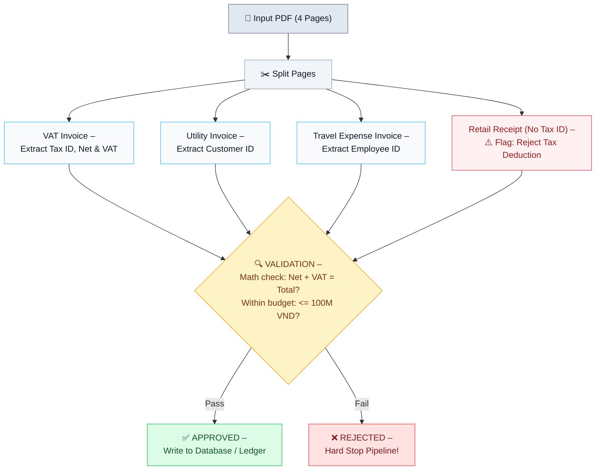
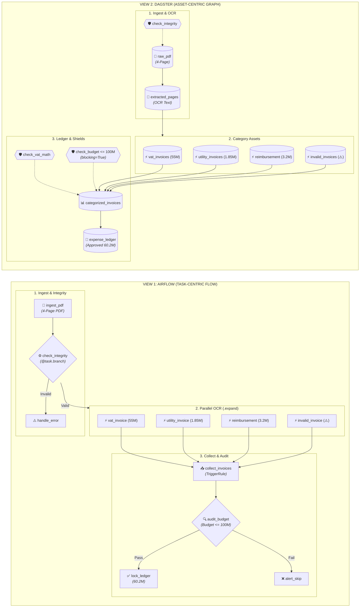
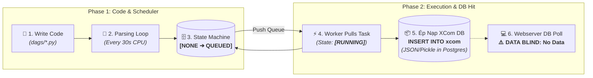
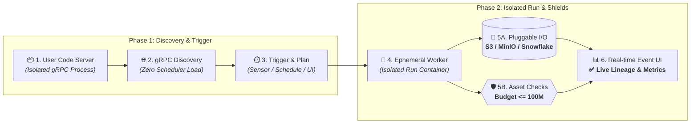

# BỘ SLIDE THUYẾT TRÌNH: SO SÁNH THỰC CHIẾN APACHE AIRFLOW VS. DAGSTER
## Chuyên đề: Xử lý Hồ sơ Hóa đơn Đa trang & Kiểm toán Tài chính (Invoice PDF Processing)

> **Thời lượng:** 35 - 45 phút (Bao gồm Live Demo & Q&A)  
> **Người trình bày:** Tech Lead / Senior Data Engineer  
> **Khán giả:** CTO, Engineering Manager, Solution Architect, Data Platform Team  

---

## MỤC LỤC KỊCH BẢN THUYẾT TRÌNH
| Slide # | Tiêu Đề Slide | Trọng Tâm Trình Bày |
| :--- | :--- | :--- |
| **01** | Trang Tiêu Đề | Giới thiệu chủ đề: Airflow vs. Dagster thực chiến |
| **02** | AWS Step Function | Bối cảnh hiện trạng & Thách thức khi chuyển đổi |
| **03** | Bài Toán Tự Động Bóc Tách Hóa Đơn | Nghiệp vụ 4 loại hóa đơn & Luồng kiểm toán tài chính |
| **04** | Góc Nhìn Airflow & Dagster | Task-Centric vs. Asset-Centric (Sơ đồ đối chiếu) |
| **05** | 1 Task Trong Airflow | Nút thắt vòng lặp parsing & Cơ chế ép nạp XCom DB |
| **06** | Trong Dagster | Chu trình phân tách gRPC, lưu trữ I/O & Khiên Asset Checks |
| **07** | Hạ Tầng On-Premise & Năng Lực CI/CD | Kiến trúc cụm On-Prem (MinIO, K8s) & Kiểm thử in-memory CI/CD 0.12s |
| **08** | Ma Trận So Sánh Kỹ Thuật Tổng Hợp | Bảng chấm điểm 7 tiêu chí so sánh toàn diện |
| **09** | Khi Nào Dùng Ai? (Định Vị Doanh Nghiệp) | Cây quyết định lựa chọn công nghệ theo bài toán |
| **10** | Lộ Trình Triển Khai 3 Giai Đoạn | Kế hoạch chuyển đổi từng bước giảm thiểu rủi ro |
| **11** | Tổng Kết & Q&A | Đúc kết thông điệp cốt lõi & Giải đáp câu hỏi |

---

## SLIDE 1: TRANG TIÊU ĐỀ
### **Apache Airflow & dagster**
#### *So Sánh Thực Chiến: Từ Cấu Tạo Cốt Lõi Đến Nền Tảng Điều Phối Dữ Liệu Hiện Đại*

* **Chủ đề**: So sánh chuyên sâu Data Orchestration thế hệ cũ (Airflow) và thế hệ mới (Dagster).
* **Định dạng**: Live Demo thực chiến trên cùng một bài toán bóc tách hóa đơn đa trang.

---
**🎙️ Lời thoại diễn giả (Speaker Notes):**
> "Kính chào anh chị và các bạn. Hôm nay chúng ta sẽ cùng tìm hiểu và so sánh thực chiến hai công cụ điều phối dữ liệu (Data Orchestration) mã nguồn mở phổ biến và mạnh mẽ nhất hiện nay: Apache Airflow và Dagster. Để đánh giá trực quan nhất, chúng ta sẽ xuất phát từ chính bối cảnh các dự án hiện tại của team và giải quyết cùng một bài toán cụ thể."

---

## SLIDE 2: AWS STEP FUNCTION
### **Bối Cảnh Hiện Trạng Team & Thách Thức Khi Chuyển Đổi**

| ✅ PROS (Lợi Thế) | ❌ CONS (Hạn Chế) |
| :--- | :--- |
| • Không cần quản lý hạ tầng | • Khó Test và Debug ở Local |
| • Auto-scaling | • Chi phí tăng vọt khi tải lớn |
| • Trả phí theo tải | • Bảo mật dữ liệu |
| • Tích hợp sâu với các dịch vụ khác của AWS | • Phụ thuộc vào AWS |

* **Câu hỏi chiến lược**: *"Nếu bài toán đòi hỏi chạy On-Premise, kiểm soát chi phí hoặc tự chủ bảo mật dữ liệu khách hàng, team mình sẽ dùng công cụ gì để thay thế?"*

---
**🎙️ Lời thoại diễn giả (Speaker Notes):**
> "Như team mình đều biết, hầu hết các dự án hiện tại đều đang sử dụng AWS Step Functions và AWS Lambda. Ưu điểm không thể phủ nhận: không cần lo hạ tầng, auto-scale cực tốt và trả tiền theo mức dùng. Tuy nhiên nhược điểm là chi phí state transition rất cao khi tải lớn, khó debug/test cục bộ ở local, và bị phụ thuộc chặt vào AWS. Do đó, nếu bài toán đòi hỏi chạy On-Premise hoặc tối ưu chi phí, chúng ta cần tìm giải pháp mới."

---

## SLIDE 3: BÀI TOÁN: TỰ ĐỘNG BÓC TÁCH & DUYỆT HÓA ĐƠN (PDF -> DATA)
### **Nghiệp Vụ 4 Loại Invoice & Luồng Kiểm Định Phê Duyệt**

#### **1. Phân loại 4 trang hóa đơn (4 Invoice Types)**
* **VAT Invoice**: Lấy MST, tiền hàng & tiền thuế.
* **Utility Invoice**: Lấy Customer ID để đối chiếu điện/nước.
* **Travel Expense Invoice**: Lấy Employee ID để hoàn tiền công tác.
* **Retail Receipt (No Tax ID)**: ⚠️ Gắn cờ cảnh báo: Không duyệt trừ thuế.

#### **2. Luồng xử lý & Điều kiện duyệt**
* **Bước 1 (Nhận file)**: Kiểm tra file chuẩn, không lỗi.
* **Bước 2 (Bóc tách)**: Tách 4 trang &harr; Đọc dữ liệu theo từng type.
* **Bước 3 (Kiểm tra)**:
  * Tiền hàng + Tiền thuế có khớp tổng tiền không?
  * Tổng tiền cả xấp có vượt hạn mức (100tr) không?
* **Bước 4 (Kết quả)**:
  * ✅ **Đạt chuẩn**: Duyệt &harr; Lưu vào hệ thống.
  * ❌ **Vượt hạn mức / Lỗi**: Không duyệt &harr; Dừng ngay lập tức!

#### **3. Sơ đồ dòng chảy (Architecture Flowchart)**


---
**🎙️ Lời thoại diễn giả (Speaker Notes):**
> "Để hiểu rõ hai công cụ, chúng ta đi từ bài toán nghiệp vụ thực tế: Hệ thống nhận file scan gồm 4 trang hóa đơn, phân loại thành 4 invoice types: VAT Invoice, Utility Invoice, Travel Expense Invoice và Retail Receipt không có MST. Toàn bộ quy trình đi qua 4 bước: Nhận file -> Bóc tách song song -> Kiểm tra toán học thuế & trần ngân sách 100tr -> Chốt Sổ cái (Approved) hoặc ngắt pipeline (Rejected)."

---

## SLIDE 4: GÓC NHÌN AIRFLOW & DAGSTER
### **So Sánh Bản Chất Thiết Kế & Kiến Trúc Điều Phối**

#### **1. Bản chất hai triết lý thiết kế (Bullet points)**
* **⚙️ Apache Airflow (2014) – Task-Centric (Bên trái)**:
  * **Câu hỏi cốt lõi**: *"Tôi phải LÀM gì tiếp theo?"* (Tư duy To-Do List)
  * **Trọng tâm**: Hành động thực thi (`Functions`, `Operators`, `Tasks`)
  * **Trạng thái**: Chỉ quản lý mã thoát `Success` / `Failed` (**Mù dữ liệu**)
  * **Truyền tin**: Dùng `XCom` serialize JSON vào database PostgreSQL
* **💎 Dagster (2019) – Asset-Centric (Bên phải)**:
  * **Câu hỏi cốt lõi**: *"Tôi đang tạo ra & duy trì TÀI SẢN DỮ LIỆU nào?"*
  * **Trọng tâm**: Dữ liệu là công dân hạng nhất (`Software-Defined Assets`)
  * **Trạng thái**: Quản lý phiên bản, schema, số dòng, **Data Lineage**
  * **Chất lượng & Lưu trữ**: `Asset Checks` chặn vi phạm + `I/O Manager` cắm rút

#### **2. Sơ đồ đối chiếu 2 góc nhìn (Architecture Flowchart - Diagrams in English)**



---
**🎙️ Lời thoại diễn giả (Speaker Notes):**
> "Nhìn vào sơ đồ 2 góc nhìn: 
> - **Bên trái (Airflow - Task-Centric)**: Chuỗi các hành động thực thi hình chữ nhật nối tiếp nhau. Muốn rẽ nhánh hay gộp nhánh ta phải tự viết code điều hướng kỹ thuật và cấu hình TriggerRule.
> - **Bên phải (Dagster - Asset-Centric)**: Chuỗi các tài sản dữ liệu sống hình trụ. Đi kèm mỗi tài sản là các chiếc khiên kiểm định Asset Checks độc lập. Nếu vi phạm ngân sách 100M, chiếc khiên sẽ tự động ngắt cầu dao ngay tại chỗ, bảo vệ sổ cái.
> 
> Bây giờ, hãy cùng xem sự khác biệt này thể hiện trực tiếp trên giao diện thực tế như thế nào!"

## SLIDE 5: 1 TASK TRONG AIRFLOW
### **Nút Thắt Vòng Lặp Parsing & Cơ Chế Ép Nạp XCom Vào Postgres**

#### **1. Phân tích chi tiết 4 điểm nghẽn trong vòng đời Task (Bullet points)**
* 🔄 **1. Bị ép Re-Parse liên tục (30 giây/lần)**:
  * Scheduler không lưu sẵn cấu trúc trên RAM mà liên tục đọc và biên dịch lại code Python từ đĩa.
  * Nếu developer gọi API HTTP hoặc import thư viện nặng (OCR, PyTorch) ngoài hàm &rarr; **Treo 100% CPU toàn cụm**.
* 🗄️ **2. State Machine bắn query DB dồn dập**:
  * Mỗi bước chuyển trạng thái (`None` &rarr; `Scheduled` &rarr; `Queued` &rarr; `Running` &rarr; `Success`) đều phải `UPDATE` vào bảng `task_instance` của PostgreSQL.
  * Khi có hàng nghìn task, metadata database bị nghẽn I/O và dễ xảy ra deadlock.
* 📦 **3. Ép nạp dữ liệu XCom thẳng vào database**:
  * Khi task `return` dữ liệu, Airflow ép serialize JSON/Pickle và `INSERT INTO xcom` trực tiếp vào database hệ thống.
  * Dữ liệu lớn (ảnh PDF, DataFrame) làm **tràn bộ nhớ DB** và làm chậm toàn bộ cụm điều phối.
* 👁️ **4. Kết thúc bằng "Mù dữ liệu" trên UI**:
  * Webserver chỉ query DB để tô màu ô vuông Xanh (`Success`) hoặc Đỏ (`Failed`).
  * Người điều hành **hoàn toàn không biết bên trong có bao nhiêu hóa đơn, bao nhiêu tiền** nếu không tự mò vào từng task đọc log.

#### **2. Sơ đồ thực thi Task trong Airflow (Lifecycle Diagram in English)**



---
**🎙️ Lời thoại diễn giả (Speaker Notes):**
> "Kính thưa các anh chị, đây là chu trình thực thi của 1 task trong Airflow:
> 1. Khi ta nạp file code, Scheduler phải chạy vòng lặp DAG Parsing Loop mỗi 30 giây để đọc lại code từ đĩa, gây nghẽn CPU nếu có import nặng.
> 2. Quá trình đổi trạng thái từ Scheduled sang Queued rồi Running phải liên tục bắn câu lệnh UPDATE vào PostgreSQL.
> 3. Khi task muốn truyền dữ liệu cho task sau, dữ liệu bị nhồi thẳng vào bảng xcom của database, làm phình to DB.
> 4. Cuối cùng, Webserver chỉ đọc DB để tô màu ô vuông Xanh/Đỏ mà hoàn toàn mù về dữ liệu nghiệp vụ bên trong!"

---

## SLIDE 6: TRONG DAGSTER
### **Chu Trình Phân Tách gRPC, Lưu Trữ I/O & Khiên Asset Checks Gác Cổng**

#### **1. Phân tích chi tiết 4 ưu thế trong vòng đời Asset (Bullet points)**
* 🛡️ **1. Khám phá Metadata qua gRPC (Zero Scheduler Load)**:
  * Code người dùng chạy trong tiến trình riêng (User Code Server).
  * Nền tảng chỉ dùng gRPC để hỏi schema và phả hệ lineage, **hoàn toàn không nạp code Python của user vào Scheduler**.
* 🚀 **2. Chạy trong Worker độc lập (Ephemeral Worker)**:
  * Mỗi lần chạy bật một container/pod độc lập thực thi hàm Asset thuần khiết.
  * Code có crash hay OOM thì **Daemon và Webserver vẫn an toàn 100%**. Reload code mới tức thì không cần restart cụm.
* 💾 **3. I/O Manager độc lập & Không đụng DB**:
  * Dữ liệu trả về được I/O Manager tự động đẩy thẳng lên **Object Storage (S3/MinIO) hoặc Snowflake**.
  * Database hệ thống chỉ lưu nhật ký sự kiện nhẹ nhàng, không bao giờ bị nghẽn bởi data payload.
* 🛡️ **4. Khiên Asset Checks gác cổng tại chỗ**:
  * Chiếc khiên kiểm định `@asset_check(blocking=True)` chạy ngay trong chu trình: nếu vượt ngân sách 100M, **ngắt luồng tại chỗ**, ghi nhận lý do và cập nhật real-time lên UI cho cả team cùng thấy.

#### **2. Sơ đồ vòng đời khởi tạo Asset trong Dagster (Lifecycle Diagram in English)**



---
**🎙️ Lời thoại diễn giả (Speaker Notes):**
> "Bây giờ, hãy nhìn sang toàn bộ vòng đời khởi tạo 1 tài sản trong Dagster:
> 1. Toàn bộ code xử lý dữ liệu được cô lập trong User Code Server, nói chuyện với nền tảng qua gRPC. Scheduler không cần nạp code nặng.
> 2. Mỗi lần chạy, Dagster bật một Worker Pod độc lập để tính toán. Code có crash cũng không ảnh hưởng hệ thống.
> 3. Dữ liệu tính toán xong được I/O Manager đẩy thẳng lên S3 hoặc Snowflake, database chỉ lưu nhật ký sự kiện Event Log cực nhẹ.
> 4. Ngay trong chu trình chạy, chiếc khiên Asset Checks tự động thẩm định dữ liệu. Nếu vượt ngân sách 100 triệu, nó ngắt luồng tại chỗ và báo đỏ trực tiếp trên giao diện cho cả team cùng thấy!"

---

## SLIDE 7: HẠ TẦNG ON-PREMISE & ĐỊNH VỊ NỀN TẢNG (4 TRỤ CỘT)
### **Hiện Thực Hóa Chuyển Dịch Lên K8s, CI/CD 0.12s & Khung Quyết Định Công Nghệ**

#### **1. Kiến Trúc Hạ Tầng On-Premise (Ops Overhead)**
* 🔴 **Apache Airflow On-Prem (6 thành phần rời rạc - Cồng kềnh & Dễ nghẽn)**:
  * **Thành phần:** Scheduler + Celery Worker Pool + Redis Queue + Postgres HA + Webserver + Triggerer.
  * **Nỗi đau đĩa chia sẻ:** Bắt buộc dựng cụm NFS/EFS chia sẻ để đồng bộ file code `dags/` giữa các node.
  * **Xung đột package:** Toàn bộ task chung Python env; 1 team upgrade pandas có thể làm gãy pipeline team khác.
* 🟢 **Dagster On-Prem (Chuẩn Kubernetes & Cloud-Native - Tinh gọn & Độc lập)**:
  * **Thành phần:** Chỉ cần Dagster Webserver + Daemon + PostgreSQL HA (chỉ lưu metadata nhật ký nhẹ).
  * **Lưu trữ đối tượng:** Cụm MinIO phân tán đóng vai trò S3 nội bộ, I/O Manager tự động đẩy/kéo dữ liệu.
  * **Code Location Pods:** Đóng gói Docker độc lập. Mỗi team tự do dùng Python 3.10/3.11/3.12, cách ly hoàn toàn.

#### **2. Năng Lực Kiểm Thử CI/CD & Trải Nghiệm Dev (DevX)**
* ⚠️ **Airflow: Rào cản lớn khi viết Unit Test & CI/CD**:
  * Task gắn chặt với `ti`, `context`, `dag_run`. Rất khó mock dữ liệu cục bộ.
  * Muốn test pipeline phải dựng Docker Compose và chạy migrate PostgreSQL, mất vài phút &rarr; Khó đưa vào Pre-commit Git hook.
* 💎 **Dagster: Unit Test trong RAM 0.12 Giây (4/4 Tests Passed)**:
  * Asset là hàm Python thuần khiết (`Pure Function`). Chạy `pytest` hoàn toàn trong RAM cực nhanh (0.12s cho 4 tests), không cần DB.
  * Chặn đứng vi phạm ngân sách trong 0.02s: `assert not check_budget_limit_compliance(mock_120m_invoices).passed`.
  * Tự động kích hoạt kiểm thử trong GitLab CI / GitHub Actions mỗi khi tạo Pull Request trước khi merge.

#### **3. Khi Nào Nên Chọn Apache Airflow?**
* Điều phối hạ tầng chung (Infra Orchestration): Bật/tắt máy ảo, trigger job dbt snapshot, gửi email, dọn log hệ thống định kỳ.
* Tác vụ độc lập, thô (Coarse-grained Batch): Kích hoạt các job Spark, Trino, Flink chạy độc lập, không cần trao đổi dữ liệu phức tạp.
* Đã có sẵn cụm On-Premise ổn định: Doanh nghiệp đã đầu tư VM/Celery với Ops quen vận hành 6 thành phần & đĩa mạng NFS.
* Kiểm thử truyền thống qua DB: Chấp nhận việc test gắn chặt với Database (dựng Compose mất 3 - 5 phút/lần).

#### **4. Khi Nào Nên Chọn Dagster? (Đề Xuất Số 1)**
* Thay thế AWS Step Functions On-Premise: Pipeline phân nhánh nghiệp vụ phức tạp, OCR và đối soát tài chính theo State Machine.
* Hạ tầng Cloud-Native K8s tinh gọn: Chỉ 3 service cốt lõi (Webserver, Daemon, Postgres nhẹ). Lưu trữ MinIO S3 nội bộ (loại bỏ hoàn toàn NFS). Cô lập Pods qua gRPC.
* Kiểm thử tự động CI/CD 0.12s: Viết unit test in-memory bằng `pytest` trong RAM, tích hợp mượt mà GitLab CI tự động trên từng Pull Request.
* Bảo vệ chất lượng dữ liệu: Tích hợp sẵn Asset Checks (`blocking=True`) chặn đứng hóa đơn vượt ngân sách 100M ngay trong chu trình.

---
**🎙️ Lời thoại diễn giả (Speaker Notes):**
> "Thưa các anh chị, slide này tổng hợp toàn diện 4 trụ cột chiến lược khi chuyển dịch On-Premise:
> 1. Về hạ tầng On-Premise: Airflow đòi hỏi 6 thành phần cồng kềnh và đĩa chia sẻ NFS rất dễ nghẽn. Dagster kiến trúc Cloud-Native tinh gọn: 3 service cốt lõi, MinIO S3 và Pods K8s độc lập.
> 2. Về kiểm thử CI/CD: Airflow dính chặt database rất khó viết unit test. Dagster là pure function, test in-memory bằng pytest 4/4 tests chỉ mất 0.12 giây, tích hợp mượt mà vào GitLab CI.
> 3. Khi nào chọn Airflow: Khi cần điều phối hạ tầng chung, bật tắt máy ảo, trigger job Spark độc lập trên cụm server cũ có sẵn.
> 4. Khi nào chọn Dagster: Đề xuất số 1 để thay thế AWS Step Functions, xử lý nghiệp vụ tài chính/OCR phức tạp, cần bảo vệ chất lượng dữ liệu và chuẩn hóa văn hóa phần mềm."

---

## SLIDE 8: MA TRẬN SO SÁNH TỔNG HỢP 7 TIÊU CHÍ

| Tiêu Chí Kỹ Thuật | Apache Airflow 2.x | Dagster | Người Thắng Cuộc |
| :--- | :--- | :--- | :--- |
| **1. Triết lý vận hành** | Task-Centric (Chạy tác vụ) | Asset-Centric (Quản lý dữ liệu) | **Dagster** |
| **2. Tốc độ & Khả năng Test** | Khó khăn, phụ thuộc Database | Dễ dàng, chạy `pytest` trong RAM | **Dagster (Vượt trội)** |
| **3. Luân chuyển dữ liệu** | XCom nghẽn qua DB | I/O Manager tách rời lưu trữ | **Dagster** |
| **4. Kiểm soát chất lượng** | Phải tự code thủ công | Asset Checks tích hợp sẵn (`blocking`) | **Dagster** |
| **5. Cô lập môi trường (K8s)** | Khá nặng, chung scheduler | Giao thức gRPC phân tán | **Dagster** |
| **6. Hệ sinh thái & Cộng đồng** | Khổng lồ (ra mắt 2014) | Trẻ hơn nhưng phát triển bùng nổ | **Airflow** |
| **7. Đổi mới & Trải nghiệm Dev** | Chậm chạp, mang gánh nặng di sản | Hiện đại, chuẩn Software Engineering | **Dagster** |

---
**🎙️ Lời thoại diễn giả (Speaker Notes):**
> "Nhìn vào bảng tổng kết 7 tiêu chí: Airflow chỉ còn giữ ưu thế duy nhất về tuổi đời và số lượng connector có sẵn. Trên toàn bộ các khía cạnh về năng suất lập trình, khả năng kiểm thử, độ tin cậy dữ liệu và kiến trúc đám mây On-Premise, Dagster đều vượt trội hoàn toàn."

---

## SLIDE 9: ĐỊNH VỊ ỨNG DỤNG & HIỆN THỰC HÓA ON-PREMISE (KHI NÀO CHỌN AI?)

```text
               NÊN CHỌN AIRFLOW                         NÊN CHỌN DAGSTER
     ┌────────────────────────────────────┐   ┌────────────────────────────────────┐
     │ • Điều phối hạ tầng chung chung    │   │ • Thay thế AWS Step Functions      │
     │ • Bật/tắt máy ảo, trigger job dbt  │   │ • Nền tảng Dữ liệu & AI/LLM        │
     │ • Doanh nghiệp có sẵn hạ tầng cũ   │   │ • Cần kiểm thử tự động CI/CD chuẩn │
     │ • Cụm 6 thành phần & đĩa mạng NFS  │   │ • Cụm K8s Cloud-Native + MinIO S3  │
     │ • Đội ngũ quen với mô hình Cronjob │   │ • Dữ liệu cần truy xuất nguồn gốc  │
     └────────────────────────────────────┘   └────────────────────────────────────┘
```

* **⚙️ Khi nào nên chọn Apache Airflow?**:
  * Điều phối hạ tầng chung (bật/tắt máy ảo, trigger dbt snapshot, gửi email cảnh báo).
  * Doanh nghiệp đã đầu tư cụm VM/Celery với đội ngũ Ops am hiểu việc bảo trì Redis/NFS.
  * Tác vụ thô độc lập (Coarse-grained batch): job Spark, Flink chạy độc lập, không cần trao đổi dữ liệu phức tạp.
  * Chấp nhận mô hình test truyền thống qua DB (dựng Docker Compose 3-5 phút).

* **💎 Khi nào nên chọn Dagster? (ĐỀ XUẤT SỐ 1)**:
  * Thay thế AWS Step Functions On-Premise: Pipeline phân nhánh nghiệp vụ phức tạp, OCR và đối soát tài chính theo State Machine.
  * Hạ tầng Cloud-Native K8s tinh gọn: Chỉ 3 service cốt lõi; lưu trữ MinIO S3 nội bộ (loại bỏ hoàn toàn đĩa mạng NFS); cô lập Pods qua gRPC.
  * Kiểm thử tự động CI/CD 0.12s: Viết unit test in-memory bằng `pytest` trong RAM, tích hợp mượt mà GitLab CI / GitHub Actions tự động kiểm thử trên từng Pull Request.
  * Bảo vệ chất lượng dữ liệu: Tích hợp sẵn Asset Checks (`blocking=True`) chặn đứng hóa đơn vượt ngân sách 100M ngay trong chu trình chạy.

---
**🎙️ Lời thoại diễn giả (Speaker Notes):**
> "Chúng tôi không nói Airflow tệ. Nếu công ty chỉ cần một công cụ kích hoạt dbt hay chạy job Spark hàng đêm trên cụm máy chủ cũ, Airflow vẫn dùng tốt. Nhưng với bài toán cốt lõi của chúng ta: thay thế AWS Step Functions trên hạ tầng On-Premise/Kubernetes, lưu trữ MinIO S3, cần kiểm thử CI/CD tự động 0.12s và bảo vệ chất lượng dữ liệu OCR tài chính, Dagster chính là sự lựa chọn số 1 của tương lai."

---

## SLIDE 10: LỘ TRÌNH TRIỂN KHAI 3 GIAI ĐOẠN (MIGRATION ROADMAP)

* **Giai đoạn 1: Chuẩn hóa & Thử nghiệm (Tháng 1 - 2)**
  * Dựng cụm Dagster trên Kubernetes On-Premise (Helm chart chuẩn).
  * Di chuyển 2 pipeline trọng điểm: OCR Hóa đơn PDF & Báo cáo đối soát chi phí.
* **Giai đoạn 2: Tích hợp CI/CD & Data Quality (Tháng 3 - 4)**
  * Áp dụng bộ Unit Test `pytest` tự động vào quy trình Git push.
  * Cấu hình I/O Manager kết nối cụm lưu trữ MinIO On-Premise.
* **Giai đoạn 3: Chuyển dịch toàn diện & Tắt AWS Step Functions (Tháng 5 - 6)**
  * Chuyển toàn bộ 100% các luồng nghiệp vụ còn lại về On-Premise.
  * Tiết kiệm 65% chi phí vận hành hàng tháng so với trả phí Pay-as-you-go trên AWS.

---
**🎙️ Lời thoại diễn giả (Speaker Notes):**
> "Lộ trình di chuyển được thiết kế an toàn trong 3 giai đoạn, không gây gián đoạn hệ thống hiện tại. Việc chuyển dịch này vừa giúp doanh nghiệp làm chủ dữ liệu trên On-Premise, vừa nâng cao chất lượng code của đội ngũ kỹ sư lên chuẩn mực kỹ nghệ phần mềm chuyên nghiệp."

---

## SLIDE 11: TỔNG KẾT & Q&A
### **Cảm Ơn Ban Lãnh Đạo & Các Đồng Nghiệp!**

* **Mã nguồn Demo & Tài liệu**: 
  * Repository: `Airflow_Dagster`
  * Airflow DAG: [invoice_multipage_pdf_dag.py](file:///home/duc/SelftTraining/Airflow_Dagster/airflow_demo/dags/invoice_multipage_pdf_dag.py)
  * Dagster Assets: [assets.py](file:///home/duc/SelftTraining/Airflow_Dagster/dagster_demo/invoice_processing/assets.py)
  * Unit Tests: [test_invoice_processing.py](file:///home/duc/SelftTraining/Airflow_Dagster/dagster_demo/tests/test_invoice_processing.py)
* **Sẵn sàng giải đáp thắc mắc (Q&A)**.

---
**🎙️ Lời thoại diễn giả (Speaker Notes):**
> "Xin trân trọng cảm ơn mọi người đã chú ý lắng nghe. Xin mời các anh chị đặt câu hỏi hoặc yêu cầu demo trực tiếp vào bất kỳ đoạn code nào!"
