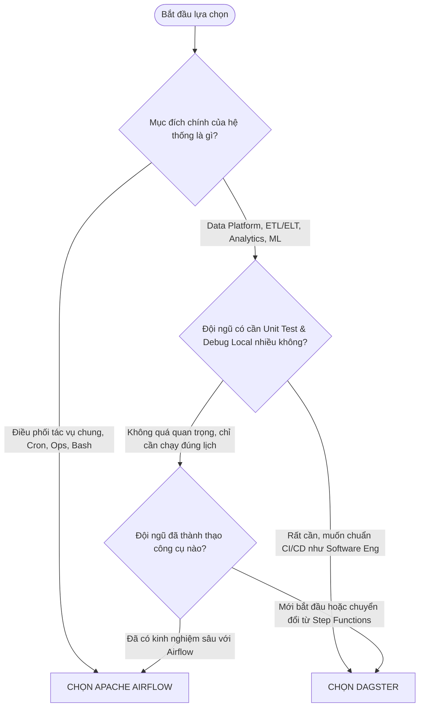

# SO SÁNH CHUYÊN SÂU: APACHE AIRFLOW VS. DAGSTER
### (Trong Bối Cảnh Chuyển Dịch từ AWS Step Functions sang On-Premise)

> **Mục đích tài liệu:** Đưa ra cái nhìn toàn diện, khách quan từ góc độ Kiến trúc sư (Architect), Kỹ sư dữ liệu (Data Engineer) và Quản trị vận hành (DevOps/SRE) để lựa chọn nền tảng Workflow Orchestration On-Premise phù hợp nhất thay thế cho AWS Step Functions.

---

## 1. BẢNG SO SÁNH TỔNG QUAN (EXECUTIVE SUMMARY)

| Tiêu chí | Apache Airflow | Dagster | Người chiến thắng |
| :--- | :--- | :--- | :---: |
| **Triết lý cốt lõi** | **Task-centric**: Tập trung vào chuỗi hành động cần thực thi (What to run) | **Asset-centric**: Tập trung vào dữ liệu cần tạo ra/cập nhật (What data to produce) | Tuỳ bài toán |
| **Trải nghiệm Dev & Test** | Trung bình. Test local nặng, cần môi trường Airflow giả lập hoặc Docker | **Xuất sắc**. Test như code Python thông thường bằng `pytest`, mock resource cực dễ | 🏆 **Dagster** |
| **Cơ chế truyền Data/State** | **XCom**: Lưu qua metadata DB. Không tối ưu cho data lớn, cần setup S3/MinIO backend | **IOManager**: Type-safe, tự động serialize/deserialize ra MinIO/Disk/DB trong suốt | 🏆 **Dagster** |
| **Kiến trúc cách ly Code** | Scheduler và Worker parse chung code; lỗi 1 DAG có thể ảnh hưởng Scheduler | **gRPC Code Locations**: Phân tách hoàn toàn Control Plane và User Code | 🏆 **Dagster** |
| **Vòng lặp động (Map State)**| Dynamic Task Mapping (`.expand()`) từ Airflow 2.3+ | `DynamicOut` + `.map()` hoặc `Partitioned Assets` | Hòa |
| **Điều kiện rẽ nhánh (Choice)**| `@task.branch` hoặc `BranchPythonOperator` | `@op` phân nhánh qua `Output(output_name=...)` | Hòa |
| **Data Lineage & Catalog** | Cần tích hợp thêm OpenLineage / Marquez | **Có sẵn 100%** trong UI (Asset Graph, Freshness SLA) | 🏆 **Dagster** |
| **Hệ sinh thái & Kết nối** | **Khổng lồ**: Hàng trăm Providers/Operators có sẵn cho mọi hệ thống on-premise | Khá tốt, tích hợp sâu với dbt, Spark, DuckDB, Snowflake, K8s | 🏆 **Airflow** |
| **Khả năng tuyển dụng** | **Rất dễ**: Là tiêu chuẩn ngành hơn 10 năm qua, nhiều ứng viên thành thạo | Đang tăng trưởng mạnh, cần thời gian onboarding concept Asset | 🏆 **Airflow** |
| **Vận hành On-Premise (K8s)**| Official Helm Chart hoàn thiện, CeleryExecutor / K8sExecutor | Official Helm Chart hoàn thiện, K8s Run Launcher tối ưu | Hòa |

---

## 2. TRIẾT LÝ THIẾT KẾ: TASK-CENTRIC VS. DATA-CENTRIC

```text
[ AWS Step Functions ]          [ Apache Airflow ]              [ Dagster ]
   State Machine                   Task DAG                   Software-Defined Assets
┌──────────────────┐           ┌──────────────────┐           ┌──────────────────┐
│ State 1 (Lambda) │           │ Task A (Extract) │           │ Asset: raw_data  │
└────────┬─────────┘           └────────┬─────────┘           └────────┬─────────┘
         │ (JSON Payload)               │ (Dependency/XCom)            │ (Data lineage)
         ▼                              ▼                              ▼
┌──────────────────┐           ┌──────────────────┐           ┌──────────────────┐
│ State 2 (ECS)    │           │ Task B (Transform)│          │ Asset: clean_data│
└──────────────────┘           └──────────────────┘           └──────────────────┘
```

### Apache Airflow: "Tôi cần chạy tác vụ gì, vào lúc nào?"
* Airflow xem workflow là **chuỗi các bước thực thi (Tasks)** được nối với nhau theo biểu đồ có hướng không chu trình (DAG).
* Airflow **không quan tâm bản chất dữ liệu bên trong là gì** hay dữ liệu chạy đi đâu; nó chỉ quan tâm Task A thành công (`SUCCESS`) thì kích hoạt Task B.
* **Hệ quả:** Thích hợp cho các tác vụ mang tính điều phối hệ thống chung (Ops, cron job, chạy script server, bảo trì DB).

### Dagster: "Dữ liệu nào cần sinh ra, và nó phụ thuộc vào dữ liệu nào?"
* Dagster đưa ra khái niệm **Software-Defined Assets (SDA)**: Mỗi node trong graph là một **Tài sản dữ liệu (Data Asset)** (một bảng trong Postgres, một file parquet trong MinIO, một model ML).
* Khi kích hoạt pipeline, Dagster hiểu rằng nó đang cần "làm tươi" (Materialize) dữ liệu đó.
* **Hệ quả:** Thích hợp hoàn hảo cho Data Platform, Data Lakehouse, Analytics và Machine Learning.

---

## 3. SO SÁNH TRỰC DIỆN CODE CÁC PATTERN TỪ STEP FUNCTIONS

Hai mã nguồn mẫu thực tế đã được xây dựng và kiểm thử trong thư mục [airflow_demo](file:///home/duc/SelftTraining/Airflow_Dagster/airflow_demo) và [dagster_demo](file:///home/duc/SelftTraining/Airflow_Dagster/dagster_demo).

### 3.1. Rẽ nhánh có điều kiện (Choice State / If-Else)

#### Step Functions (ASL):
Dùng `Choice` state kiểm tra biến JSON Path `$.Payload.is_active`.

#### Apache Airflow:
Dùng decorator `@task.branch`. Hàm trả về string chính là `task_id` của nhánh tiếp theo:
```python
@task.branch
def check_batch_condition(batch_info: dict) -> str:
    if batch_info.get("is_active") and len(batch_info.get("orders", [])) > 0:
        return "prepare_orders_for_mapping"  # Nhánh IF
    return "handle_skipped_batch"            # Nhánh ELSE
```

#### Dagster:
Dùng decorator `@op` với khai báo nhiều output tùy chọn (`is_required=False`):
```python
@op(out={"process_branch": Out(is_required=False), "skip_branch": Out(is_required=False)})
def check_batch_condition(orders: list, is_active: bool):
    if is_active and len(orders) > 0:
        yield Output(orders, output_name="process_branch")
    else:
        yield Output("Batch is empty or inactive", output_name="skip_branch")
```

> **Nhận xét:**
> * Cả hai đều tự nhiên hơn nhiều so với cú pháp JSON dài dòng của Step Functions.
> * Airflow liên kết bằng tên Task ID (chuỗi string), còn Dagster liên kết trực tiếp qua biến Python type-safe.

---

### 3.2. Vòng lặp song song qua danh sách (Dynamic Map State / Loop)

#### Step Functions (ASL):
Dùng `Map` state với `Iterator` hoặc Distributed Map.

#### Apache Airflow:
Dùng **Dynamic Task Mapping** với toán tử `.expand()`:
```python
# orders_list là list các phần tử sinh ra từ task trước
# Airflow tự động nhân bản (fan-out) N instance task chạy song song
mapped_orders = process_single_order.expand(order=orders_list)
```

#### Dagster:
Dùng **`DynamicOut` + `.map()`**:
```python
@op(out=DynamicOut())
def fan_out_orders(orders: list):
    for order in orders:
        yield DynamicOutput(value=order, mapping_key=order["order_id"].replace("-", "_"))

# Thực thi map trên từng dynamic output
dynamic_orders = fan_out_orders(process_branch)
processed = dynamic_orders.map(process_single_order)
```

> **Nhận xét:**
> * Cú pháp `.expand()` của Airflow ngắn gọn hơn.
> * Cơ chế `DynamicOut` của Dagster cho phép đặt `mapping_key` rõ ràng để theo dõi từng task instance trên UI.

---

### 3.3. Thu thập kết quả sau vòng lặp (Fan-in / Aggregation)

#### Apache Airflow:
Airflow tự động gom kết quả của các mapped task thành một list truyền vào task tiếp theo, nhưng cần lưu ý cấu hình `trigger_rule` khi có rẽ nhánh trước đó:
```python
@task(trigger_rule=TriggerRule.NONE_FAILED_MIN_ONE_SUCCESS)
def aggregate_results(processed_orders: List[dict]):
    total_revenue = sum(item["final_price"] for item in processed_orders)
    return {"total": total_revenue}
```

#### Dagster:
Dagster dùng hàm `.collect()` tường minh để gom các dynamic output lại thành 1 list:
```python
@op
def aggregate_results(processed_orders: List[dict]):
    total_revenue = sum(item["final_price"] for item in processed_orders)
    return {"total": total_revenue}

# Gọi gom kết quả trong Job:
aggregate_results(processed.collect())
```

---

### 3.4. Cơ chế truyền dữ liệu & Trạng thái giữa các bước (State Passing)

Đây là điểm khác biệt lớn nhất ảnh hưởng trực tiếp đến hiệu năng và tính ổn định:

| Đặc điểm | AWS Step Functions | Apache Airflow (XCom) | Dagster (IOManager) |
| :--- | :--- | :--- | :--- |
| **Dung lượng tối đa** | 256 KB (Bắt buộc đẩy S3 nếu lớn hơn) | Khuyên dùng < 48 KB (lưu trong DB) | **Không giới hạn** (Tùy storage backend) |
| **Vị trí lưu trữ** | AWS State Engine | PostgreSQL Database (mặc định) | MinIO / S3 / Local Disk / Snowflake |
| **Cách lập trình** | JSON path: `$.Payload.data` | `ti.xcom_pull(...)` hoặc TaskFlow return | Return trực tiếp giá trị Python / DataFrame |
| **Type-Safety** | Không | Không | **Có** (Kiểm tra kiểu dữ liệu đầu ra/vào) |

> ⚠️ **Cảnh báo với Airflow:** Nếu truyền dữ liệu DataFrame Pandas hoặc danh sách hàng nghìn bản ghi qua XCom mặc định của Airflow, cơ sở dữ liệu PostgreSQL sẽ bị phình to và làm nghẽn Scheduler. Với Dagster, `IOManager` tự động ghi DataFrame ra Parquet trên MinIO và nạp lại ở bước sau mà developer không cần viết thêm dòng code upload/download nào.

---

### 3.5. Kiểm định chất lượng dữ liệu & Rẽ nhánh đồ thị (Data Quality & Branching Lineage)

#### Apache Airflow:
Airflow giải quyết điều kiện rẽ nhánh ở cấp độ Task:
* Dùng `@task.branch` để chọn task thực thi tiếp theo.
* Khi chạy, các task không được chọn sẽ mang trạng thái `SKIPPED` (màu hồng trên Graph View).
* Không có cơ chế bản địa để hiển thị kết quả kiểm định dữ liệu trực tiếp trên UI (thường phải dùng thư viện ngoài như Great Expectations hoặc tự ghi log).

#### Dagster:
Dagster đưa Data Quality và Lineage thành công dân hạng nhất:
* **`@asset_check`:** Gắn trực tiếp lên Asset để kiểm tra tính toàn vẹn (ví dụ phát hiện đơn Soft-Delete `is_deleted`). Dagster hiển thị ngay **Huy hiệu Badge cảnh báo (WARN/ERROR)** trực tiếp trên Asset Catalog.
* **Đồ thị rẽ nhánh 3 Asset độc lập:** Từ `raw_orders_batch`, Dagster rẽ thành 3 luồng tài sản chuyên biệt:
  * `vip_orders` (Áp dụng chính sách VIP, giảm 10%, voucher 100$)
  * `standard_orders` (Giá chuẩn)
  * `quarantined_orders` (Cách ly đơn hủy/xóa để phục vụ kiểm toán)
  * Hội tụ về `batch_financial_summary` (Tổng hợp doanh thu $4,480).

---

## 4. TRẢI NGHIỆM LẬP TRÌNH & KIỂM THỬ (DEVELOPER EXPERIENCE)

Nỗi đau lớn nhất của AWS Step Functions là **Feedback Loop quá chậm**: Muốn test một thay đổi nhỏ, kỹ sư phải deploy lên AWS Cloud và chờ kích hoạt execution.

```text
Thời gian Feedback Loop khi sửa 1 dòng code:
┌───────────────────────────────┬─────────────────┐
│ AWS Step Functions (Deploy)   │ 3 - 5 phút      │
│ Apache Airflow (Docker/CLI)   │ 30 - 60 giây    │
│ Dagster (pytest local)        │ 1 - 3 giây      │ ⚡ NHANH NHẤT
└───────────────────────────────┴─────────────────┘
```

### Tại sao Dagster vượt trội về Testing? (Bản chất kỹ thuật)
Trong [test_order_processing.py](file:///home/duc/SelftTraining/Airflow_Dagster/dagster_demo/tests/test_order_processing.py), bạn có thể:
1. **Test từng Op đơn lẻ như 1 hàm Python thuần túy:**
   ```python
   def test_single_order():
       res = process_single_order({"order_id": "1", "amount": 1000})
       assert res["tier"] == "VIP"
   ```
2. **Test toàn bộ Pipeline trong tiến trình (In-Process) không cần Database:**
   ```python
   def test_pipeline():
       result = order_processing_job.execute_in_process()
       assert result.success
   ```
3. **Mock Resource & IOManager:** Dễ dàng thay thế kết nối Database thật bằng dữ liệu mẫu trong RAM khi chạy CI/CD.

---

## 5. BẢN CHẤT CÁCH CHẠY & "UNDER THE HOOD" (VÌ SAO LẠI THẾ?)

Để hiểu sâu và thuyết phục được các kỹ sư/kiến trúc sư kỳ cựu, chúng ta cần mổ xẻ xem **bên dưới nắp ca-pô (Under the hood)**, hai hệ thống hoạt động ra sao và vì sao lại có sự khác biệt đó.

```
┌─────────────────────────────────────────────────────────────────────────────┐
│ 1. VÒNG ĐỜI THỰC THI TRONG APACHE AIRFLOW (MONOLITHIC & POLLING)            │
│                                                                             │
│ [Thư mục dags/*.py]                                                         │
│        │ (Quét & Parse lại liên tục mỗi 30s)                                │
│        ▼                                                                    │
│ [Scheduler Loop] ──(Tạo DagRun/TaskInstance)──> [PostgreSQL Metadata DB]   │
│        │                                                                    │
│        ▼ (Đẩy Task ID vào Message Queue)                                    │
│ [Celery / Redis Broker]                                                     │
│        │                                                                    │
│        ▼ (Worker nhặt task, parse lại file DAG)                             │
│ [Airflow Worker Process]                                                    │
│        ├── Chạy Python code của task                                        │
│        └── Nếu có return ──(INSERT INTO xcom SQL)──> [PostgreSQL Metadata]  │
└─────────────────────────────────────────────────────────────────────────────┘

┌─────────────────────────────────────────────────────────────────────────────┐
│ 2. VÒNG ĐỜI THỰC THI TRONG DAGSTER (DECOUPLED & EVENT-DRIVEN)               │
│                                                                             │
│ [User Code Repository] ──(Load 1 lần duy nhất)──> [gRPC Code Location]     │
│                                                          ▲                  │
│                                          (Hỏi Metadata)  │ gRPC             │
│ [Dagster Daemon / Webserver] ────────────────────────────┘                  │
│        │ (Kích hoạt Run)                                                    │
│        ▼                                                                    │
│ [Run Coordinator / Launcher] ──(Khởi tạo Container độc lập)                │
│        │                                                                    │
│        ▼                                                                    │
│ [Ephemeral K8s Pod / Process]                                               │
│        ├── Chạy Op 1 (Pure Python)                                          │
│        ├── IOManager bắt lấy Output ──(Lưu file)──> [MinIO / S3 Object Store│
│        ├── Bắn Event Log (Success/Metadata) ──────> [PostgreSQL Metadata]   │
│        └── Chạy Op 2: IOManager tự tải file từ MinIO nạp vào Input Op 2     │
└─────────────────────────────────────────────────────────────────────────────┘
```

### 5.1. Apache Airflow: Cơ Chế Polling & DAG Parsing Loop

* **Cơ chế hoạt động:**
  1. Scheduler của Airflow có một tiến trình con gọi là `DAG File Processor`. Tiến trình này **quét liên tục thư mục chứa code (`/dags`) theo chu kỳ (mặc định mỗi 30 giây)**.
  2. Nó thực thi lệnh `import` và chạy toàn bộ mã nguồn ở tầng ngoài (top-level code) của từng file `.py` để biên dịch cây DAG thành JSON lưu vào database.
  3. Khi đến lịch chạy, Scheduler tạo bản ghi `DagRun` trong Postgres, rồi đẩy lệnh qua hàng đợi Redis/RabbitMQ.
  4. Worker ở node khác nhặt task từ Redis. Worker này **lại phải đọc và parse lại file `.py` lần nữa** để tìm đúng hàm cần chạy, rồi mới bắt đầu tính toán.
  5. Nếu hàm trả về giá trị, Worker serialize đối tượng và chạy câu lệnh `INSERT INTO xcom ...` trực tiếp vào PostgreSQL.

* **Vì sao Airflow lại thiết kế như vậy? (Bối cảnh lịch sử 2014):**
  * Airflow muốn hỗ trợ tính năng **Dynamic DAGs** (tạo số lượng task linh hoạt dựa vào biến số hoặc query ngoài). Muốn biết hôm nay có bao nhiêu task, Scheduler bắt buộc phải liên tục "chạy thử" file Python để đếm task.
  * Ban đầu, Airflow chỉ điều phối các job Spark/Hadoop khổng lồ bên ngoài. Dữ liệu cần truyền giữa các task chỉ là chuỗi string nhỏ (đường dẫn HDFS, partition name, job ID), do đó lưu tạm vào PostgreSQL (XCom) là giải pháp nhanh gọn nhất lúc bấy giờ.

* **Hậu quả trong kỷ nguyên hiện đại:**
  * **CPU Spike do Polling:** Scheduler tiêu tốn 50-80% CPU chỉ để làm một việc: đọc đi đọc lại các file `.py` dù file không hề thay đổi.
  * **Top-Level Code Trap:** Nếu lập trình viên lỡ tay viết một dòng kết nối DB (`conn = psycopg2.connect(...)`) hoặc gọi API ở ngoài hàm `@task`, kết nối đó sẽ bị gọi lại sau mỗi 30 giây $\rightarrow$ gây nghẽn toàn bộ hạ tầng mạng và Database!
  * **XCom Bloat:** Khi lập trình viên dùng Python hiện đại xử lý Pandas DataFrame, danh sách JSON lớn, hoặc ảnh OCR, XCom nhồi hàng trăm MB vào Postgres làm nghẽn I/O và treo Scheduler.

---

### 5.2. Dagster: Kiến Trúc Phân Tách Code Location & In-Memory Engine

* **Cơ chế hoạt động:**
  1. **Tách biệt Control Plane & User Code:** Lõi điều phối (Dagster Daemon + Webserver) **hoàn toàn không chứa và không đọc code** của kỹ sư. Code của kỹ sư được đóng gói thành một tiến trình máy chủ gRPC riêng biệt gọi là **Code Location**.
  2. Khi khởi động, Code Location nạp code **MỘT LẦN DUY NHẤT** để xây dựng đồ thị Asset Graph và lưu sẵn trong bộ nhớ.
  3. Webserver/Daemon khi cần xem giao diện hay lên lịch chỉ việc gửi một bản tin gRPC siêu nhẹ hỏi: *"Code Location cho tôi xem danh sách Asset hiện tại"*.
  4. Khi kích hoạt chạy (Run):
     - Dagster không đẩy task qua một hàng đợi Celery chung chạ. Thay vào đó, **Run Launcher** khởi tạo một tiến trình mới (hoặc 1 Kubernetes Pod độc lập).
     - Pod này chạy từ đầu đến cuối luồng xử lý hoặc phân nhánh theo cấu hình.
  5. **IOManager Middleware:** 
     - Hàm Python của bạn chỉ làm nghiệp vụ thuần túy (`return cleaned_df`).
     - Tầng trung gian `IOManager` đón lấy DataFrame này, tự động serialize thành file `.parquet` đẩy vào MinIO/S3.
     - Bước tiếp theo cần dùng dữ liệu, `IOManager` tự động kết nối MinIO tải file về và deserialize thành DataFrame nạp vào tham số đầu vào.
     - Cơ sở dữ liệu PostgreSQL **chỉ lưu đúng trạng thái RUNNING/SUCCESS và metadata nhỏ** (ví dụ: số dòng, thời gian chạy, confidence score).

* **Vì sao Dagster lại thiết kế như vậy? (Bối cảnh 2018):**
  * Tác giả Dagster (Nick Schrock) nhìn thấy rõ những "vết xe đổ" của Airflow: lỗi code của một team làm sập Scheduler chung, dữ liệu lớn làm nghẽn DB, và không thể test local.
  * Ông áp dụng triết lý kiến trúc phần mềm hiện đại: **Dependency Injection** (tiêm phụ thuộc) và **Phân tách trách nhiệm (Separation of Concerns)** giữa logic tính toán (Compute) và cơ chế lưu trữ (Storage).

* **Tại sao Dagster test được bằng Pytest trong 1.9 giây?**
  * Vì Dagster được xây dựng từ lõi như một **Thư viện tính toán đồ thị (Graph Execution Engine)** chứ không phải một dịch vụ daemon nguyên khối.
  * Khi bạn gọi `order_processing_job.execute_in_process()` hoặc `materialize()` trong Pytest:
    - Dagster **KHÔNG CẦN** Webserver, không cần Daemon, không cần PostgreSQL, không cần gRPC server, không cần Docker.
    - Toàn bộ đồ thị được giải quyết trực tiếp trong RAM của tiến trình Pytest. `IOManager` mặc định lúc này là `mem_io_manager` (giữ data trong biến bộ nhớ) hoặc `fs_io_manager` (lưu file tạm trên đĩa cứng máy local).
    - Vì vậy, tốc độ test chính là tốc độ thực thi thuần túy của code Python bạn viết!

---

## 6. VẬN HÀNH TRÊN HẠ TẦNG KUBERNETES ON-PREMISE (OPS & ARCHITECTURE)

### 6.1. Khả năng cô lập mã nguồn (Code Isolation)

* **Vấn đề của Airflow (Monolithic Environment):**
  * Nếu dùng CeleryExecutor, các worker dùng chung một môi trường virtualenv Python lớn. Khi Team A cần `pandas==2.0` còn Team B cần `pandas==1.5`, xung đột package là điều không thể tránh khỏi.
  * Nếu dùng KubernetesExecutor để cách ly Pod, mỗi task phải khởi tạo 1 Pod mới từ đầu, gây overhead độ trễ từ 5 - 15 giây cho mỗi task nhỏ.
* **Giải pháp của Dagster (Multi-Tenant by Design):**
  * Mỗi repository/team đóng gói code thành 1 container Code Location riêng. Team A dùng image Python 3.10, Team B dùng image Python 3.12 hoàn toàn độc lập.
  * Lỗi code hoặc lỗi crash bộ nhớ (OOM) ở pipeline A **hoàn toàn không ảnh hưởng** đến pipeline B hay giao diện điều hành chung.

### 6.2. Mức độ tiêu thụ tài nguyên

* **Airflow:** Thường yêu cầu cụm Redis + PostgreSQL + Celery Workers (hoặc K8sExecutor). Scheduler liên tục tốn tài nguyên cho vòng lặp parse DAG.
* **Dagster:** Cực kỳ nhẹ ở tầng Scheduler (chỉ cần Dagster Daemon + PostgreSQL). Khi có job chạy mới cấp phát tài nguyên tính toán thông qua K8s Run Launcher.

---

## 6. KHUYẾN NGHỊ RA QUYẾT ĐỊNH (DECISION FRAMEWORK)



### ✅ CHỌN APACHE AIRFLOW KHI:
1. Bạn cần một giải pháp "an toàn về mặt nhân sự": Dễ dàng tuyển dụng kỹ sư có sẵn kỹ năng Airflow trên thị trường.
2. Hệ thống on-premise của bạn cần kết nối với nhiều nguồn dữ liệu đặc thù, legacy (Mainframe, FTP cũ, SAP, Oracle) thông qua các Provider có sẵn.
3. Pipeline của bạn phần lớn là kích hoạt các job độc lập bên ngoài (vd: trigger job Spark ngoài, trigger stored procedure) thay vì trực tiếp xử lý dữ liệu trong Python.

### ✅ CHỌN DAGSTER KHI:
1. Bạn muốn giải quyết dứt điểm nỗi ức chế lớn nhất của Step Functions: **Không thể debug/test cục bộ**.
2. Dự án là **Data Platform hiện đại**: Bạn cần theo dõi Data Lineage (dòng chảy dữ liệu từ nguồn đến dashboard), Data Quality và Data Freshness SLA trực quan trên UI mà không cần cài thêm công cụ thứ ba.
3. Muốn hệ thống On-Premise ổn định dài hạn nhờ kiến trúc cách ly Code Location (nhiều team dùng chung cluster không sợ xung đột dependency).
