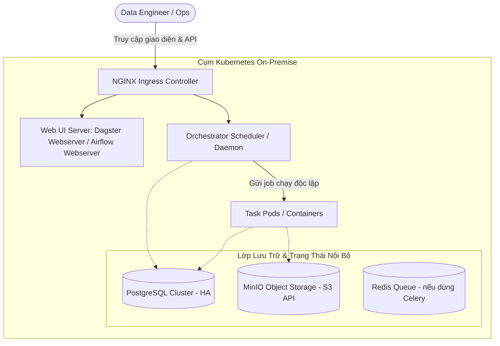

# Hướng Dẫn Kỹ Thuật: So Sánh Chi Tiết & Chuyển Dịch từ AWS Step Functions sang On-Premise (Airflow vs. Dagster)

Tài liệu này cung cấp chi tiết kỹ thuật chuyên sâu làm nền tảng bổ trợ cho bài thuyết trình, bao gồm so sánh kiến trúc, ánh xạ code mẫu (ASL sang Airflow & Dagster), và thiết kế hạ tầng On-Premise.

---

## 1. SO SÁNH TỔNG QUAN 3 NỀN TẢNG

| Tiêu chí | AWS Step Functions | Apache Airflow | Dagster |
| :--- | :--- | :--- | :--- |
| **Mô hình kiến trúc** | Serverless State Machine (ASL JSON) | Task-based Directed Acyclic Graph (DAG) | Software-Defined Asset (SDA) & Ops/Jobs |
| **Môi trường chạy** | Độc quyền AWS Cloud | Đa nền tảng (Kubernetes, Docker, VM, Bare-metal) | Đa nền tảng (Kubernetes, Docker, VM, Bare-metal) |
| **Cơ chế truyền dữ liệu** | JSON Payload qua States (Giới hạn tối đa 256 KB) | XCom (Mặc định qua DB; khuyến nghị lưu metadata nhỏ) | `IOManager` (Type-safe, tự lưu vào MinIO/Filesystem/S3) |
| **Khả năng Test Local** | Rất thấp (Local mock hạn chế, thường test trên cloud) | Trung bình (Dùng `airflow tasks test`, Docker Compose) | **Rất cao** (Native Unit Testing với `pytest`, Mock Resources) |
| **Dynamic Workflows** | Dynamic Map State | Dynamic Task Mapping (`.expand()`) | Dynamic Outputs / Partitioned Assets |
| **Phân tách Code & Engine**| Engine trên Cloud hoàn toàn | Scheduler & Worker chia sẻ Python environment chung | **Hoàn toàn độc lập** (Core Engine giao tiếp qua gRPC) |
| **Data Lineage** | Xem Execution History dạng flow | Grid view, Lineage qua OpenLineage/Marquez | **Native Asset Catalog & Lineage UI** |
| **Chi phí vận hành** | Pay-per-state-transition | Chi phí phần cứng On-premise + DevOps | Chi phí phần cứng On-premise + DevOps |

---

## 2. ÁNH XẠ CODE MẪU: CHUYỂN ĐỔI WORKFLOW CÓ ĐIỀU KIỆN (BRANCHING)

Bài toán: Kiểm tra số lượng bản ghi hợp lệ. Nếu `>= 100`, thực hiện tổng hợp báo cáo (Aggregated Report), ngược lại thông báo cảnh báo (Send Warning).

### 2.1. AWS Step Functions (Amazon States Language - ASL)
```json
{
  "Comment": "Data Processing with Choice State",
  "StartAt": "ValidateData",
  "States": {
    "ValidateData": {
      "Type": "Task",
      "Resource": "arn:aws:states:::lambda:invoke",
      "Parameters": {
        "FunctionName": "ValidateDataLambda"
      },
      "Next": "CheckRecordCount"
    },
    "CheckRecordCount": {
      "Type": "Choice",
      "Choices": [
        {
          "Variable": "$.Payload.record_count",
          "NumericGreaterThanEquals": 100,
          "Next": "ProcessReport"
        }
      ],
      "Default": "SendWarning"
    },
    "ProcessReport": {
      "Type": "Task",
      "Resource": "arn:aws:states:::ecs:runTask.sync",
      "End": true
    },
    "SendWarning": {
      "Type": "Task",
      "Resource": "arn:aws:states:::sns:publish",
      "End": true
    }
  }
}
```

---

### 2.2. Chuyển Đổi Sang Apache Airflow (Dùng TaskFlow API)
```python
from datetime import datetime
from airflow.decorators import dag, task
from airflow.operators.empty import EmptyOperator

@dag(
    schedule_interval=None,
    start_date=datetime(2026, 1, 1),
    catchup=False,
    tags=["migration", "step_functions"]
)
def data_processing_airflow():

    @task
    def validate_data() -> dict:
        # Giả lập logic kiểm tra dữ liệu
        return {"record_count": 120}

    @task.branch
    def check_record_count(payload: dict) -> str:
        if payload.get("record_count", 0) >= 100:
            return "process_report"
        return "send_warning"

    @task
    def process_report():
        print("Đang xử lý báo cáo tổng hợp dữ liệu...")

    @task
    def send_warning():
        print("Cảnh báo: Số lượng bản ghi quá ít (< 100)!")

    # Thiết lập phụ thuộc luồng chạy
    data = validate_data()
    branch = check_record_count(data)
    
    branch >> [process_report(), send_warning()]

dag_instance = data_processing_airflow()
```

---

### 2.3. Chuyển Đổi Sang Dagster (Software-Defined Assets & Ops)
```python
import pytest
from dagster import op, job, Out, Output

@op(out={"record_count": Out(int)})
def validate_data():
    # Logic kiểm tra dữ liệu
    return 120

@op(out={"process_branch": Out(is_required=False), "warning_branch": Out(is_required=False)})
def check_record_count(record_count: int):
    if record_count >= 100:
        yield Output(value=record_count, output_name="process_branch")
    else:
        yield Output(value=record_count, output_name="warning_branch")

@op
def process_report(record_count: int):
    print(f"Xử lý báo cáo thành công với {record_count} bản ghi.")

@op
def send_warning(record_count: int):
    print(f"Cảnh báo: Chỉ có {record_count} bản ghi!")

@job
def data_processing_dagster():
    count = validate_data()
    proc, warn = check_record_count(count)
    process_report(proc)
    send_warning(warn)

# --- Khả năng Unit Test cực mạnh trên Dagster (Chạy local bằng pytest) ---
def test_data_processing_success():
    result = data_processing_dagster.execute_in_process()
    assert result.success
```

---

## 3. THIẾT KẾ HẠ TẦNG ON-PREMISE (KUBERNETES BLUEPRINT)

Để thay thế toàn bộ năng lực của AWS Cloud (S3, Lambda/ECS, IAM, CloudWatch), hệ thống On-Premise cần thiết lập cụm dịch vụ tương đương:



### Các thành phần thay thế chi tiết:

| Thành phần AWS Cloud | Thành phần On-Premise thay thế | Vai trò |
| :--- | :--- | :--- |
| **AWS Step Functions Engine** | **Dagster Daemon** hoặc **Airflow Scheduler** | Quản lý lịch chạy, điều phối dependency, retry |
| **AWS S3 (State/Data/Logs)** | **MinIO Cluster** (chuẩn S3 API) | Lưu artifact, log execution, intermediate data |
| **AWS CloudWatch (Logs/Metrics)** | **Prometheus + Grafana + Loki / ELK** | Giám sát tài nguyên CPU/RAM, tập trung log |
| **AWS IAM** | **Kubernetes RBAC + HashiCorp Vault / SealedSecrets** | Quản lý quyền truy cập và bảo mật credentials |
| **AWS Lambda / ECS Task** | **Kubernetes Pods** | Chạy các compute workload độc lập và cô lập |

---

## 4. MA TRẬN ĐÁNH GIÁ CHI TIẾT (DEEP-DIVE EVALUATION)

| Khía cạnh kỹ thuật | Apache Airflow | Dagster | Nhận xét chuyên gia |
| :--- | :---: | :---: | :--- |
| **Kiến trúc phân tách User Code** | Thấp - Trung bình | **Rất cao** | Trong Airflow, nếu 1 DAG bị syntax error hoặc xung đột package có thể ảnh hưởng Scheduler parse time. Dagster đóng gói code theo từng Code Location độc lập chạy qua gRPC. |
| **Khả năng kiểm thử (Unit Testing)** | 6.5/10 | **9.5/10** | Dagster cho phép test từng `@op` hoặc cả `@job` trong bộ nhớ mà không cần kết nối DB hay cụm K8s. |
| **Xử lý dữ liệu lớn giữa các Task** | 6.0/10 | **9.0/10** | Airflow XCom không sinh ra để lưu dữ liệu lớn. Dagster `IOManager` được sinh ra để tự động đẩy và kéo DataFrame/file từ MinIO. |
| **Data Lineage & Freshness** | Cần thêm plugin | **Sẵn có 100%** | Dagster định nghĩa trực tiếp Data Asset, biết rõ asset nào lỗi thời cần được tính toán lại. |
| **Hệ sinh thái kết nối (Ecosystem)** | **10/10** | 7.5/10 | Airflow có hàng trăm Operator sẵn cho Kafka, Trino, Spark, MSSQL, Oracle, v.v. |
| **Thời gian làm quen (Learning Curve)** | Dễ tiếp cận ban đầu | Cần học triết lý Asset | Với đội ngũ chưa quen concept Data Asset, Dagster cần khoảng 1-2 tuần làm quen. |

---

## 5. KẾT LUẬN & ĐỀ XUẤT CHO DỰ ÁN

1. **Nếu mục tiêu là di chuyển nhanh 1:1 theo tư duy Task:**
   * **Apache Airflow** là lựa chọn phổ biến, dễ dàng tìm kiếm tài liệu và nhân sự trên thị trường.
2. **Nếu muốn giải quyết tận gốc hạn chế của Step Functions (Local Test, Data Flow, CI/CD):**
   * **Dagster** là lựa chọn vượt trội về mặt kỹ thuật dài hạn, đặc biệt khi hệ thống On-Premise định hướng làm nền tảng xử lý dữ liệu (Data Platform/Lakehouse).
